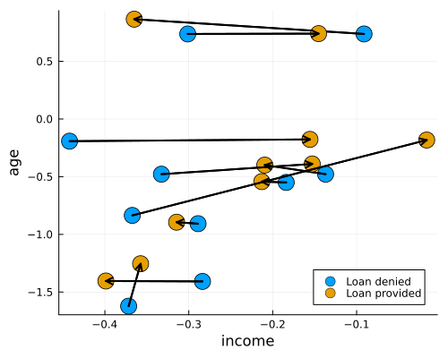

# CounterfactualExplanations


*Counterfactual Explanations and Algorithmic Recourse in Julia.*

[](https://juliatrustworthyai.github.io/CounterfactualExplanations.jl/stable) [](https://juliatrustworthyai.github.io/CounterfactualExplanations.jl/dev) [](https://github.com/juliatrustworthyai/CounterfactualExplanations.jl/actions/workflows/CI.yml?query=branch%3Amain) [](https://codecov.io/gh/juliatrustworthyai/CounterfactualExplanations.jl) [](https://github.com/invenia/BlueStyle) [](LICENSE) [](https://pkgs.genieframework.com?packages=CounterfactualExplanations)

`CounterfactualExplanations.jl` is a package for generating Counterfactual Explanations (CE) and Algorithmic Recourse (AR) for black-box algorithms. Both CE and AR are related tools for explainable artificial intelligence (XAI). While the package is written purely in Julia, it can be used to explain machine learning algorithms developed and trained in other popular programming languages like Python and R. See below for a short introduction and other resources or dive straight into the [docs](https://juliatrustworthyai.github.io/CounterfactualExplanations.jl/dev).

There is also a corresponding paper, [*Explaining Black-Box Models through Counterfactuals*](https://proceedings.juliacon.org/papers/10.21105/jcon.00130), which has been published in JuliaCon Proceedings. Please consider citing the paper, if you use this package in your work:

[](https://doi.org/10.21105/jcon.00130) [](https://zenodo.org/badge/latestdoi/440782065)

    @article{Altmeyer2023,
      doi = {10.21105/jcon.00130},
      url = {https://doi.org/10.21105/jcon.00130},
      year = {2023},
      publisher = {The Open Journal},
      volume = {1},
      number = {1},
      pages = {130},
      author = {Patrick Altmeyer and Arie van Deursen and Cynthia C. s. Liem},
      title = {Explaining Black-Box Models through Counterfactuals},
      journal = {Proceedings of the JuliaCon Conferences}
    }

## 🚩 Installation

You can install the stable release from [Julia’s General Registry](https://github.com/JuliaRegistries/General) as follows:

``` julia
using Pkg
Pkg.add("CounterfactualExplanations")
```

`CounterfactualExplanations.jl` is under active development. To install the development version of the package you can run the following command:

``` julia
using Pkg
Pkg.add(url="https://github.com/juliatrustworthyai/CounterfactualExplanations.jl")
```

## 🤔 Background and Motivation

Machine learning models like Deep Neural Networks have become so complex, opaque and underspecified in the data that they are generally considered Black Boxes. Nonetheless, such models often play a key role in data-driven decision-making systems. This creates the following problem: human operators in charge of such systems have to rely on them blindly, while those individuals subject to them generally have no way of challenging an undesirable outcome:

> “You cannot appeal to (algorithms). They do not listen. Nor do they bend.”
>
> — Cathy O’Neil in [*Weapons of Math Destruction*](https://en.wikipedia.org/wiki/Weapons_of_Math_Destruction), 2016

## 🔮 Enter: Counterfactual Explanations

Counterfactual Explanations can help human stakeholders make sense of the systems they develop, use or endure: they explain how inputs into a system need to change for it to produce different decisions. Explainability benefits internal as well as external quality assurance.

Counterfactual Explanations have a few properties that are desirable in the context of Explainable Artificial Intelligence (XAI). These include:

- Full fidelity to the black-box model, since no proxy is involved.
- No need for (reasonably) interpretable features as opposed to LIME and SHAP.
- Clear link to Algorithmic Recourse and Causal Inference.
- Less susceptible to adversarial attacks than LIME and SHAP.

### Example: Give Me Some Credit

Consider the following real-world scenario: a retail bank is using a black-box model trained on their clients’ credit history to decide whether they will provide credit to new applicants. To simulate this scenario, we have pre-trained a binary classifier on the publicly available Give Me Some Credit dataset that ships with this package (Kaggle 2011).

The figure below shows counterfactuals for 10 randomly chosen individuals that would have been denied credit initially.



### Example: MNIST

The figure below shows a counterfactual generated for an image classifier trained on MNIST: in particular, it demonstrates which pixels need to change in order for the classifier to predict 4 instead of 9.

Since `v0.1.9` counterfactual generators are fully composable. Here we have composed a generator that combines ideas from Joshi et al. (2019) (REVISE) and Schut et al. (2021):

``` julia
# Compose generator:
generator = GradientBasedGenerator()
@chain generator begin
    @objective logitcrossentropy + 0.001distance_l2     
    @with_optimiser JSMADescent(η=0.5)                  # Greedy (Schut et al. 2021)
    @search_latent_space                                # REVISE (Joshi et al. 2019)
end
```


## 🔍 Usage example

Generating counterfactuals will typically look like follows. Below we first fit a simple model to a synthetic dataset with linearly separable features and then draw a random sample:

``` julia
# Data and Classifier:
counterfactual_data = load_linearly_separable()
M = fit_model(counterfactual_data, :Linear)

# Select random sample:
target = 2
factual = 1
chosen = rand(findall(predict_label(M, counterfactual_data) .== factual))
x = select_factual(counterfactual_data, chosen)
```

To this end, we specify a counterfactual generator of our choice:

``` julia
# Counterfactual search:
generator = DiCEGenerator(λ=[0.1,0.3])
```

Here, we have chosen to use the `GradientBasedGenerator` to move the individual from its factual label 1 to the target label 2.

With all of our ingredients specified, we finally generate counterfactuals using a simple API call:

``` julia
ce = generate_counterfactual(
  x, target, counterfactual_data, M, generator; 
  num_counterfactuals=3, converge_when=:generator_conditions,
  gradient_tol=1e-3
)
```

The animation below shows the resulting counterfactual path:


## ☑️ Implemented Counterfactual Generators

Currently, the following counterfactual generators are implemented:

- ClaPROAR (Altmeyer et al. 2023)
- CLUE (Antorán et al. 2020)
- DiCE (Mothilal, Sharma, and Tan 2020)
- FeatureTweak (Tolomei et al. 2017)
- Generic
- GravitationalGenerator (Altmeyer et al. 2023)
- Greedy (Schut et al. 2021)
- GrowingSpheres (Laugel et al. 2017)
- PROBE (Pawelczyk et al. 2022)
- REVISE (Joshi et al. 2019)
- Wachter (Wachter, Mittelstadt, and Russell 2017)

## 🎯 Goals and limitations

The goal of this library is to contribute to efforts towards trustworthy machine learning in Julia. The Julia language has an edge when it comes to trustworthiness: it is very transparent. Packages like this one are generally written in pure Julia, which makes it easy for users and developers to understand and contribute to open-source code. Eventually, this project aims to offer a one-stop-shop of counterfactual explanations.

Our ambition is to enhance the package through the following features:

1.  Support for all supervised machine learning models trained in [`MLJ.jl`](https://alan-turing-institute.github.io/MLJ.jl/dev/).
2.  Support for regression models.

## 🛠 Contribute

Contributions of any kind are very much welcome! Take a look at the [issue](https://github.com/juliatrustworthyai/CounterfactualExplanations.jl/issues) to see what things we are currently working on.

If any of the below applies to you, this might be the right open-source project for you:

- You’re an expert in Counterfactual Explanations or Explainable AI more broadly and you are curious about Julia.
- You’re experienced with Julia and are happy to help someone less experienced to up their game. Ideally, you are also curious about Trustworthy AI.
- You’re new to Julia and open-source development and would like to start your learning journey by contributing to a recent and active development. Ideally, you are familiar with machine learning.

[@pat-alt](https://github.com/pat-alt) here: I am still very much at the beginning of my Julia journey, so if you spot any issues or have any suggestions for design improvement, please just open [issue](https://github.com/juliatrustworthyai/CounterfactualExplanations.jl/issues) or start a [discussion](https://github.com/juliatrustworthyai/CounterfactualExplanations.jl/discussions).

For more details on how to contribute see [here](https://www.paltmeyer.com/CounterfactualExplanations.jl/dev/contributing/). Please follow the [SciML ColPrac guide](https://github.com/SciML/ColPrac).

## 🎓 Citation

If you want to use this codebase, please consider citing the corresponding paper:

    @article{Altmeyer2023,
      doi = {10.21105/jcon.00130},
      url = {https://doi.org/10.21105/jcon.00130},
      year = {2023},
      publisher = {The Open Journal},
      volume = {1},
      number = {1},
      pages = {130},
      author = {Patrick Altmeyer and Arie van Deursen and Cynthia C. s. Liem},
      title = {Explaining Black-Box Models through Counterfactuals},
      journal = {Proceedings of the JuliaCon Conferences}
    }

## 📚 References

Altmeyer, Patrick, Giovan Angela, Aleksander Buszydlik, Karol Dobiczek, Arie van Deursen, and Cynthia Liem. 2023. “Endogenous Macrodynamics in Algorithmic Recourse.” In *First IEEE Conference on Secure and Trustworthy Machine Learning*. <https://doi.org/10.1109/satml54575.2023.00036>.

Antorán, Javier, Umang Bhatt, Tameem Adel, Adrian Weller, and José Miguel Hernández-Lobato. 2020. “Getting a Clue: A Method for Explaining Uncertainty Estimates.” <https://arxiv.org/abs/2006.06848>.

Joshi, Shalmali, Oluwasanmi Koyejo, Warut Vijitbenjaronk, Been Kim, and Joydeep Ghosh. 2019. “Towards Realistic Individual Recourse and Actionable Explanations in Black-Box Decision Making Systems.” <https://arxiv.org/abs/1907.09615>.

Kaggle. 2011. “Give Me Some Credit, Improve on the State of the Art in Credit Scoring by Predicting the Probability That Somebody Will Experience Financial Distress in the Next Two Years.” Kaggle. <https://www.kaggle.com/c/GiveMeSomeCredit>.

Laugel, Thibault, Marie-Jeanne Lesot, Christophe Marsala, Xavier Renard, and Marcin Detyniecki. 2017. “Inverse Classification for Comparison-Based Interpretability in Machine Learning.” <https://arxiv.org/abs/1712.08443>.

Mothilal, Ramaravind K, Amit Sharma, and Chenhao Tan. 2020. “Explaining Machine Learning Classifiers Through Diverse Counterfactual Explanations.” In *Proceedings of the 2020 Conference on Fairness, Accountability, and Transparency*, 607–17. <https://doi.org/10.1145/3351095.3372850>.

Pawelczyk, Martin, Teresa Datta, Johannes van-den-Heuvel, Gjergji Kasneci, and Himabindu Lakkaraju. 2022. “Probabilistically Robust Recourse: Navigating the Trade-Offs Between Costs and Robustness in Algorithmic Recourse.” *arXiv Preprint arXiv:2203.06768*.

Schut, Lisa, Oscar Key, Rory Mc Grath, Luca Costabello, Bogdan Sacaleanu, Yarin Gal, et al. 2021. “Generating Interpretable Counterfactual Explanations By Implicit Minimisation of Epistemic and Aleatoric Uncertainties.” In *International Conference on Artificial Intelligence and Statistics*, 1756–64. PMLR.

Tolomei, Gabriele, Fabrizio Silvestri, Andrew Haines, and Mounia Lalmas. 2017. “Interpretable Predictions of Tree-Based Ensembles via Actionable Feature Tweaking.” In *Proceedings of the 23rd ACM SIGKDD International Conference on Knowledge Discovery and Data Mining*, 465–74. <https://doi.org/10.1145/3097983.3098039>.

Wachter, Sandra, Brent Mittelstadt, and Chris Russell. 2017. “Counterfactual Explanations Without Opening the Black Box: Automated Decisions and the GDPR.” *Harv. JL & Tech.* 31: 841. <https://doi.org/10.2139/ssrn.3063289>.
