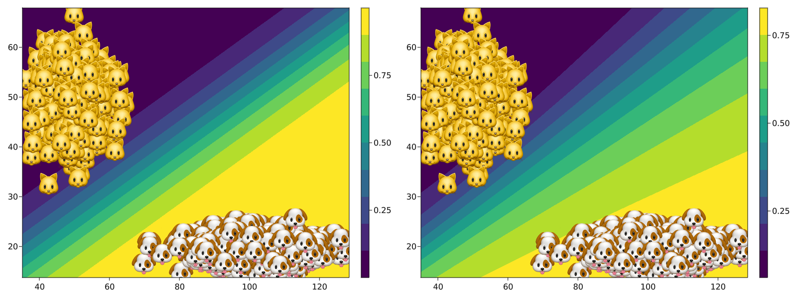
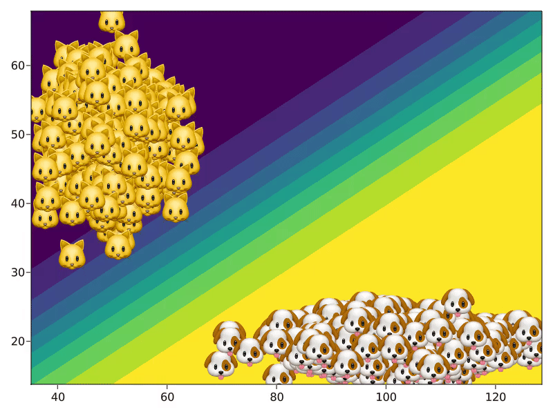
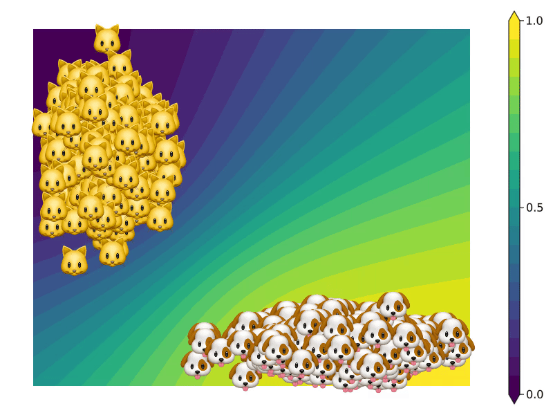

``` @meta
CurrentModule = CounterfactualExplanations
```

# From 🐱 to 🐶 - a motivating example

Suppose we have a sample of cats and dogs with information about two features: height and tail length. Based on these two features we have trained two black box classifiers to distinguish between cats and dogs: firstly, an artificial neural network with weight regularization and secondly, that same neural network but its Bayesian counterpart ([Figure 1](#fig-predictive) below). One individual cat – let’s call her Kitty 🐱 – is friends with a lot of cool dogs and wants to be part of that group. Let’s see how we can generate counterfactual paths for her.



### From basic principles …

Counterfactual search happens in the feature space: we are interested in understanding how we need to change 🐱’s attributes in order to change the output of the black-box classifier. We will start with the first model, that relies on simple plugin estimates to produce its predictions. The model was pre-trained using Flux.jl and can be loaded as follows:

``` julia
using CounterfactualExplanations.Data: cats_dogs_model
model = cats_dogs_model()
```

In order to make the Flux.jl model compatible with CounterfactualExplanations.jl we need to run the following (more on this in the [models tutorial](https://www.paltmeyer.com/CounterfactualExplanations.jl/dev/tutorials/models/)):

``` julia
import CounterfactualExplanations.Models: logits, probs # import functions in order to extend

# Step 1)
struct NeuralNetwork <: Models.AbstractFittedModel
    model::Any
end

# Step 2)
logits(𝑴::NeuralNetwork, X::AbstractArray) = 𝑴.model(X)
probs(𝑴::NeuralNetwork, X::AbstractArray)= σ.(logits(𝑴, X))
𝑴 = NeuralNetwork(model);
```

Let `x` be the 2D-feature vector describing Kitty 🐱. Based on those features she is currently labelled as `y = 0.0`. We have set the target label to `1.0` and the desired confidence in the prediction to `γ = 0.75`. Now we can use the `GenericGenerator` for our counterfactual search as follows:

``` julia
generator = GenericGenerator(0.01,2,1e-5,:logitbinarycrossentropy,nothing)
recourse = generate_counterfactual(generator, x, 𝑴, target, γ)
```

The `GenericGenerator` implements the search algorithm first proposed by Wachter, Mittelstadt, and Russell (2017). The resulting counterfactual path is shown in [Figure 2](#fig-recourse-mlp) below. We can see that 🐱 travels through the feature space until she reaches a destination where the black-box model predicts that with a probability of more than 75% she is actually a dog. Her counterfactual self is in the target class so the algorithmic recourse objective is satisfied. We have also gained an intuitive understanding of how the black-model arrives at its decisions: increasing height and decreasing tail length both raise the predicted probability that 🐱 is actually a dog.



### … towards realistic counterfactuals.

The generic search above yielded a counterfactual sample that is still quite distinct from all other individuals in the target class. While we successfully fooled the black-box model, a human might look at 🐱’s counterfactual self and get a little suspicious. One of the requirements for algorithmic recourse is that counterfactuals are realistic and unambigous. A straight-forward way to meet this requirement is to generate counterfactuals by implicitly minimizing predictive uncertainty (Schut et al. 2021). The simple neural network does not incorporate uncertainty, but its Bayesian counterpart does: note how in [Figure 1](#fig-predictive) above the contours for the Bayesian neural network (Laplace) fan out away from the sample. As before we will be using a pre-trained model. Laplace approximation was implemented using [BayesLaplace.jl](https://www.paltmeyer.com/BayesLaplace.jl/dev/) (see [here](https://towardsdatascience.com/go-deep-but-also-go-bayesian-ab25efa6f7b) for an introduction). The pre-trained Bayesian model can be loaded as follows:

``` julia
using CounterfactualExplanations.Data: cats_dogs_laplace
la = cats_dogs_laplace()
```

As before we need to make the model compatible with CounterfactualExplanations.jl:

``` julia
# Step 1)
struct LaplaceNeuralNetwork <: Models.AbstractFittedModel
    la::BayesLaplace.LaplaceRedux
end

# Step 2)
logits(𝑴::LaplaceNeuralNetwork, X::AbstractArray) = 𝑴.la.model(X)
probs(𝑴::LaplaceNeuralNetwork, X::AbstractArray)= BayesLaplace.predict(𝑴.la, X)
𝑴ᴸ = LaplaceNeuralNetwork(la);
```

Using the same target and desired confidence `γ` as above we finally use the `GreedyGenerator` generator for our counterfactual search:

``` julia
generator = GreedyGenerator(0.1,20,:logitbinarycrossentropy,nothing)
recourse = generate_counterfactual(generator, x, 𝑴ᴸ, target, γ); # generate recourse
```

The `GreedyGenerator` implements the approach proposed in Schut et al. (2021): by maximizing the predicted probability of the Bayesian model in [Figure 3](#fig-recourse-laplace) below, we implicitly minimize the predictive uncertainty around the counterfactual. This way we end up generating a counterfactual that looks more like the individuals 🐶 in the target class and is therefore more realistic.



### References

Schut, Lisa, Oscar Key, Rory Mc Grath, Luca Costabello, Bogdan Sacaleanu, Yarin Gal, et al. 2021. “Generating Interpretable Counterfactual Explanations by Implicit Minimisation of Epistemic and Aleatoric Uncertainties.” In *International Conference on Artificial Intelligence and Statistics*, 1756–64. PMLR.

Wachter, Sandra, Brent Mittelstadt, and Chris Russell. 2017. “Counterfactual Explanations Without Opening the Black Box: Automated Decisions and the GDPR.” *Harv. JL & Tech.* 31: 841.
