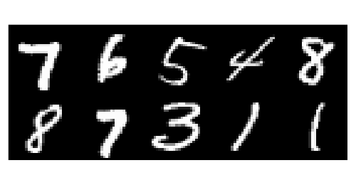
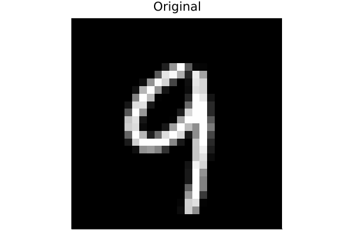
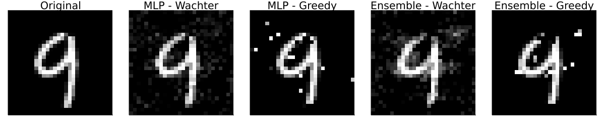

``` @meta
CurrentModule = CounterfactualExplanations 
```

# MNIST

In this examples we will see how different counterfactual generators can be used to explain deep learning models for image classification. In particular, we will look at MNIST data and visually inspect how the different generators perturb images of handwritten digits in order to change the predicted label to a target label. [Figure 1](#fig-samples) shows a random sample of handwritten digits.

``` julia
using CounterfactualExplanations, Plots, MLDatasets
using MLDatasets.MNIST: convert2image
using BSON: @save, @load
```

``` julia
train_x, train_y = MNIST.traindata()
input_dim = prod(size(train_x[:,:,1]))
using Images, Random, StatsBase
Random.seed!(1)
n_samples = 10
samples = train_x[:,:,sample(1:end, n_samples, replace=false)]
mosaic = mosaicview([convert2image(samples[:,:,i]) for i ∈ 1:n_samples]...,ncol=Int(n_samples/2))
plt = plot(mosaic, size=(500,260), axis=nothing, background=:transparent)
savefig(plt, "www/mnist_samples.png")
```



## Pre-trained classifiers

Next we will load two pre-trained deep-learning classifiers:

1.  Simple MLP - `model`
2.  Deep ensemble - `ensemble`

``` julia
using Flux
using CounterfactualExplanations.Data: mnist_data, mnist_model, mnist_ensemble
x,y,data = getindex.(Ref(mnist_data()), ("x", "y", "data"))
model = mnist_model()
ensemble = mnist_ensemble();
```

The following code just prepares the models to be used with CounterfactualExplanations.jl:

``` julia
using CounterfactualExplanations, CounterfactualExplanations.Models
import CounterfactualExplanations.Models: logits, probs # import functions in order to extend

# MLP:
# Step 1)
struct NeuralNetwork <: Models.AbstractFittedModel
    nn::Any
end
# Step 2)
logits(M::NeuralNetwork, X::AbstractArray) = M.nn(X)
probs(M::NeuralNetwork, X::AbstractArray)= softmax(logits(M, X))
M = NeuralNetwork(model)

# Deep ensemble:
# Step 1)
struct FittedEnsemble <: Models.AbstractFittedModel
    ensemble::AbstractArray
end
# Step 2)
using Statistics
logits(M::FittedEnsemble, X::AbstractArray) = mean(Flux.stack([nn(X) for nn in M.ensemble],3), dims=3)
probs(M::FittedEnsemble, X::AbstractArray) = mean(Flux.stack([softmax(nn(X)) for nn in M.ensemble],3),dims=3)
M_ensemble=FittedEnsemble(ensemble);
```

## Generating counterfactuals

We will look at four different approaches here:

1.  Generic approach for the MLP (Wachter, Mittelstadt, and Russell 2017).
2.  Greedy approach for the MLP.
3.  Generic approach for the deep ensemble.
4.  Greedy approach for the deep ensemble (Schut et al. 2021).

They can be implemented using the `GenericGenerator` and the `GreedyGenerator`.

### Turning a 9 into a 4

We will start with an example that should yield intuitive results: the process of turning a handwritten 9 in [Figure 2](#fig-nine) into a 4 is straight-forward for a human - just erase the top part. Let’s see how the different algorithmic approaches perform.

``` julia
# Randomly selected factual:
Random.seed!(1234);
x = Flux.unsqueeze(x[:,rand(1:size(x)[2])],2)
target = 5
γ = 0.95
img = convert2image(reshape(x,Int(sqrt(input_dim)),Int(sqrt(input_dim))))
plt_orig = plot(img, title="Original", axis=nothing)
savefig(plt_orig, "www/mnist_original.png")
```



The code below implements the four different approaches one by one. [Figure 3](#fig-example) shows the resulting counterfactuals. In every case the desired label switch is achieved, that is the corresponding classifier classifies the counterfactual as a four. But arguably from a human perspective only the counterfactuals for the deep ensemble look like a 4. For the MLP, both the generic and the greedy approach generate coutnerfactuals that look much like adversarial examples.

``` julia
# Generic - MLP
generator = GenericGenerator(0.1,0.1,1e-5,:logitcrossentropy,nothing)
counterfactual = generate_counterfactual(generator, x, M, target, γ; feasible_range=(0.0,1.0)) # generate recourse
img = convert2image(reshape(counterfactual.x′,Int(sqrt(input_dim)),Int(sqrt(input_dim))))
plt_wachter = plot(img, title="MLP - Wachter")

# Greedy - MLP
generator = GreedyGenerator(0.1,15,:logitcrossentropy,nothing)
counterfactual = generate_counterfactual(generator, x, M, target, γ; feasible_range=(0.0,1.0)) # generate recourse
img = convert2image(reshape(counterfactual.x′,Int(sqrt(input_dim)),Int(sqrt(input_dim))))
plt_greedy = plot(img, title="MLP - Greedy")

# Generic - Deep Ensemble
generator = GenericGenerator(0.1,0.1,1e-5,:logitcrossentropy,nothing)
counterfactual = generate_counterfactual(generator, x, M_ensemble, target, γ; feasible_range=(0.0,1.0)) # generate recourse
img = convert2image(reshape(counterfactual.x′,Int(sqrt(input_dim)),Int(sqrt(input_dim))))
plt_wachter_de = plot(img, title="Ensemble - Wachter")

# Greedy - Deep Ensemble
generator = GreedyGenerator(0.1,15,:logitcrossentropy,nothing)
counterfactual = generate_counterfactual(generator, x, M_ensemble, target, γ; feasible_range=(0.0,1.0)) # generate recourse
img = convert2image(reshape(counterfactual.x′,Int(sqrt(input_dim)),Int(sqrt(input_dim))))
plt_greedy_de = plot(img, title="Ensemble - Greedy")

plt_list = [plt_orig, plt_wachter, plt_greedy, plt_wachter_de, plt_greedy_de]
plt = plot(plt_list...,layout=(1,length(plt_list)),axis=nothing, size=(1200,240))
savefig(plt, "www/MNIST_9to4.png")
```



### References

Schut, Lisa, Oscar Key, Rory Mc Grath, Luca Costabello, Bogdan Sacaleanu, Yarin Gal, et al. 2021. “Generating Interpretable Counterfactual Explanations by Implicit Minimisation of Epistemic and Aleatoric Uncertainties.” In *International Conference on Artificial Intelligence and Statistics*, 1756–64. PMLR.

Wachter, Sandra, Brent Mittelstadt, and Chris Russell. 2017. “Counterfactual Explanations Without Opening the Black Box: Automated Decisions and the GDPR.” *Harv. JL & Tech.* 31: 841.
