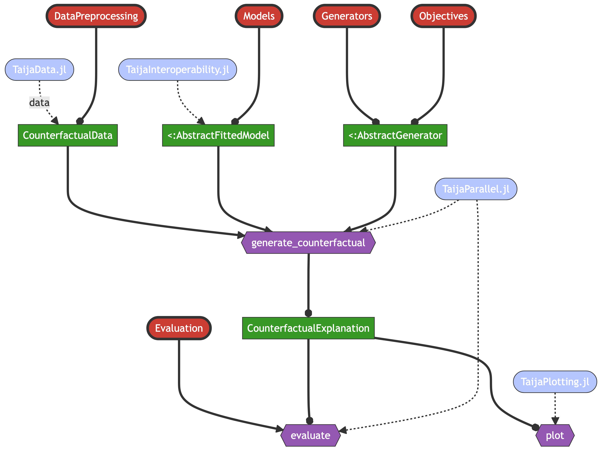

``` @meta
CurrentModule = CounterfactualExplanations 
```

## Package Architecture

The diagram below provides an overview of the package architecture. It is built around two core modules that are designed to be as extensible as possible through dispatch: 1) `Models` is concerned with making any arbitrary model compatible with the package; 2) `Generators` is used to implement arbitrary counterfactual search algorithms.[1]

The core function of the package, [`generate_counterfactual`](@ref), uses an instance of type [`AbstractModel`](@ref) produced by the `Models` module and an instance of type [`AbstractGenerator`](@ref) produced by the `Generators` module.

Metapackages from the [Taija](https://github.com/JuliaTrustworthyAI) ecosystem provide additional functionality such as datasets, language interoperability, parallelization, and plotting. The `CounterfactualExplanations` package is designed to be used in conjunction with these metapackages, but can also be used as a standalone package.



[1] We have made an effort to keep the code base a flexible and extensible as possible, but cannot guarantee at this point that any counterfactual generator can be implemented without further adaptation.
