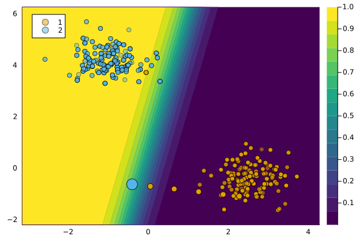

``` @meta
CurrentModule = CounterfactualExplanations 
```

# `ClaPROARGenerator`

The `ClaPROARGenerator` was introduced in Altmeyer et al. (2023).

## Description

The acronym **Clap** stands for **classifier-preserving**. The approach is loosely inspired by ROAR (Upadhyay, Joshi, and Lakkaraju 2021). Altmeyer et al. (2023) propose to explicitly penalize the loss incurred by the classifer when evaluated on the counterfactual $x^\prime$ at given parameter values. Formally, we have

``` math
\begin{aligned}
\text{extcost}(f(\mathbf{s}^\prime)) = l(M(f(\mathbf{s}^\prime)),y^\prime)
\end{aligned}
```

for each counterfactual $k$ where $l$ denotes the loss function used to train $M$. This approach is based on the intuition that (endogenous) model shifts will be triggered by counterfactuals that increase classifier loss (Altmeyer et al. 2023).

## Usage

The approach can be used in our package as follows:

``` julia
generator = ClaPROARGenerator()
ce = generate_counterfactual(x, target, counterfactual_data, M, generator)
plot(ce)
```



### Comparison to `GenericGenerator`

The figure below compares the outcome for the `GenericGenerator` and the `ClaPROARGenerator`.


## References

Altmeyer, Patrick, Giovan Angela, Aleksander Buszydlik, Karol Dobiczek, Arie van Deursen, and Cynthia Liem. 2023. “Endogenous Macrodynamics in Algorithmic Recourse.” In *First IEEE Conference on Secure and Trustworthy Machine Learning*. <https://doi.org/10.1109/satml54575.2023.00036>.

Upadhyay, Sohini, Shalmali Joshi, and Himabindu Lakkaraju. 2021. “Towards Robust and Reliable Algorithmic Recourse.” <https://arxiv.org/abs/2102.13620>.
