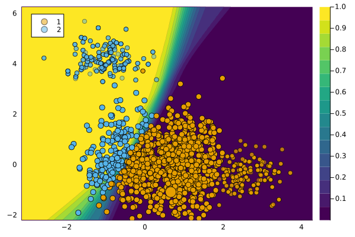

# `CLUEGenerator`

``` @meta
CurrentModule = CounterfactualExplanations 
```

In this tutorial, we introduce the CLUEGenerator, a counterfactual generator based on the Counterfactual Latent Uncertainty Explanations (CLUE) method proposed by Antorán et al. (2020).

## Description

The CLUEGenerator leverages differentiable probabilistic models, such as Bayesian Neural Networks (BNNs), to estimate uncertainty in predictions. It aims to provide interpretable counterfactual explanations by identifying input patterns that lead to predictive uncertainty. The generator utilizes a latent variable framework and employs a decoder from a variational autoencoder (VAE) to generate counterfactual samples in latent space.

The CLUE algorithm minimizes a loss function that combines uncertainty estimates and the distance between the generated counterfactual and the original input. By optimizing this loss function iteratively, the CLUEGenerator generates counterfactuals that are similar to the original observation but assigned low uncertainty.

The formula for predictive entropy is as follow:

``` math
\begin{aligned}
H(y^*|x^*, D) &= - \sum_{k=1}^{K} p(y^*=c_k|x^*, D) \log p(y^*=c_k|x^*, D)
\end{aligned}
```

## Usage

While using one must keep in mind that the CLUE algorithim is meant to find a more robust datapoint of the same class, using CLUE generator without any additional penalties/losses will mean that it is not a counterfactual generator. The generated result will be of the same class as the original input, but a more robust datapoint.

CLUE works best for BNN’s. The CLUEGenerator can be used with any differentiable probabilistic model, but the results may not be as good as with BNNs.

The CLUEGenerator can be used in the following manner:

``` julia
generator = CLUEGenerator()
M = fit_model(counterfactual_data, :DeepEnsemble)
ce = generate_counterfactual(
    x, target, counterfactual_data, M, generator;
    converge_when=:max_iter, max_iter=1000)
plot(ce)
```



Extra: The CLUE generator can also be used upon already having achieved a counterfactual with a different generator. In this case you can use CLUE and make the counterfactual more robust.

*Note: The above documentation is based on the information provided in the CLUE paper. Please refer to the original paper for more detailed explanations and implementation specifics.*

## References

Antorán, Javier, Umang Bhatt, Tameem Adel, Adrian Weller, and José Miguel Hernández-Lobato. 2020. “Getting a Clue: A Method for Explaining Uncertainty Estimates.” <https://arxiv.org/abs/2006.06848>.
