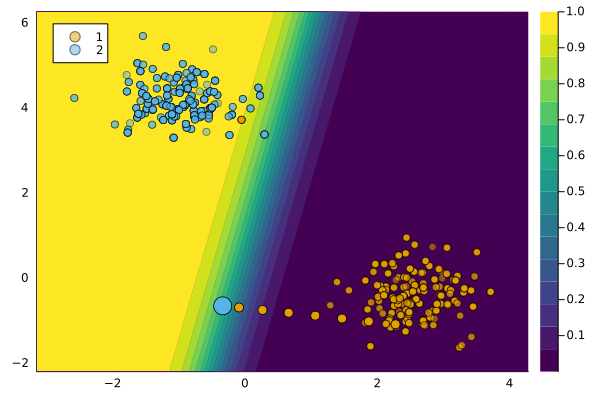

``` @meta
CurrentModule = CounterfactualExplanations 
```

# `GenericGenerator`

We use the term **generic** to relate to the basic counterfactual generator proposed by Wachter, Mittelstadt, and Russell (2017) with $L1$-norm regularization. There is also a variant of this generator that uses the distance metric proposed in Wachter, Mittelstadt, and Russell (2017), which we call `WachterGenerator`.

## Description

As the term indicates, this approach is simple: it forms the baseline approach for gradient-based counterfactual generators. Wachter, Mittelstadt, and Russell (2017) were among the first to realise that

> \[…\] explanations can, in principle, be offered without opening the “black box.”
>
> — Wachter, Mittelstadt, and Russell (2017)

Gradient descent is performed directly in the feature space. Concerning the cost heuristic, the authors choose to penalize the distance of counterfactuals from the factual value. This is based on the intuitive notion that larger feature perturbations require greater effort.

## Usage

The approach can be used in our package as follows:

``` julia
generator = GenericGenerator()
ce = generate_counterfactual(x, target, counterfactual_data, M, generator)
plot(ce)
```



## References

Wachter, Sandra, Brent Mittelstadt, and Chris Russell. 2017. “Counterfactual Explanations Without Opening the Black Box: Automated Decisions and the GDPR.” *Harv. JL & Tech.* 31: 841. <https://doi.org/10.2139/ssrn.3063289>.
