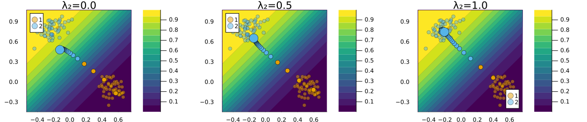
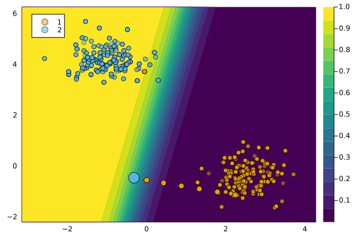

# `GravitationalGenerator`

``` @meta
CurrentModule = CounterfactualExplanations 
```

The `GravitationalGenerator` was introduced in Altmeyer et al. (2023). It is named so because it generates counterfactuals that gravitate towards some sensible point in the target domain.

## Description

Altmeyer et al. (2023) extend the general framework as follows,

``` math
\begin{aligned}
\mathbf{s}^\prime &= \arg \min_{\mathbf{s}^\prime \in \mathcal{S}} \{ {\text{yloss}(M(f(\mathbf{s}^\prime)),y^*)} \\ &+ \lambda_1 {\text{cost}(f(\mathbf{s}^\prime))} + \lambda_2 {\text{extcost}(f(\mathbf{s}^\prime))} \}  
\end{aligned} 
```

where $\text{cost}(f(\mathbf{s}^\prime))$ denotes the proxy for costs faced by the individual. “The newly introduced term $\text{extcost}(f(\mathbf{s}^\prime))$ is meant to capture and address external costs incurred by the collective of individuals in response to changes in $\mathbf{s}^\prime$.” (Altmeyer et al. 2023)

For the `GravitationalGenerator` we have,

``` math
\begin{aligned}
\text{extcost}(f(\mathbf{s}^\prime)) = \text{dist}(f(\mathbf{s}^\prime),\bar{x}^*)  
\end{aligned}
```

where $\bar{x}$ is some sensible point in the target domain, for example, the subsample average $\bar{x}^*=\text{mean}(x)$, $x \in \mathcal{D}_1$.

There is a tradeoff then, between the distance of counterfactuals from their factual value and the chosen point in the target domain. The chart below illustrates how the counterfactual outcome changes as the penalty $\lambda_2$ on the distance to the point in the target domain is increased from left to right (holding the other penalty term constant).



## Usage

The approach can be used in our package as follows:

``` julia
generator = GravitationalGenerator()
ce = generate_counterfactual(x, target, counterfactual_data, M, generator)
display(plot(ce))
```



### Comparison to `GenericGenerator`

The figure below compares the outcome for the `GenericGenerator` and the `GravitationalGenerator`.


## References

Altmeyer, Patrick, Giovan Angela, Aleksander Buszydlik, Karol Dobiczek, Arie van Deursen, and Cynthia Liem. 2023. “Endogenous Macrodynamics in Algorithmic Recourse.” In *First IEEE Conference on Secure and Trustworthy Machine Learning*.
