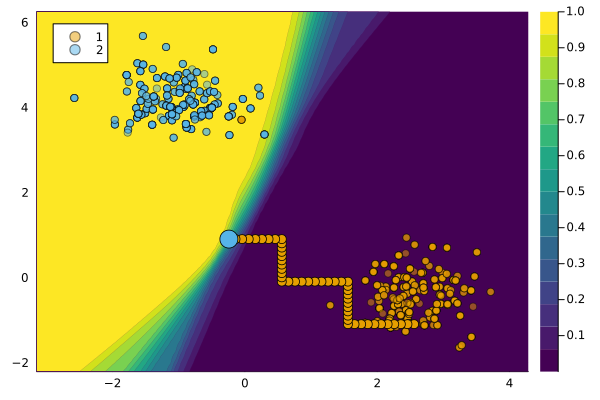

``` @meta
CurrentModule = CounterfactualExplanations 
```

# `GreedyGenerator`

We use the term **greedy** to describe the counterfactual generator introduced by Schut et al. (2021).

## Description

The Greedy generator works under the premise of generating realistic counterfactuals by minimizing predictive uncertainty. Schut et al. (2021) show that for models that incorporates predictive uncertainty in their predictions, maximizing the predictive probability corresponds to minimizing the predictive uncertainty: by construction, the generated counterfactual will therefore be *realistic* (low epistemic uncertainty) and *unambiguous* (low aleatoric uncertainty).

For the counterfactual search Schut et al. (2021) propose using a Jacobian-based Saliency Map Attack(JSMA). It is **greedy** in the sense that it is an “iterative algorithm that updates the most salient feature, i.e. the feature that has the largest influence on the classification, by $\delta$ at each step” (Schut et al. 2021).

## Usage

The approach can be used in our package as follows:

``` julia
M = fit_model(counterfactual_data, :DeepEnsemble)
generator = GreedyGenerator()
ce = generate_counterfactual(x, target, counterfactual_data, M, generator)
plot(ce)
```



Schut, Lisa, Oscar Key, Rory Mc Grath, Luca Costabello, Bogdan Sacaleanu, Yarin Gal, et al. 2021. “Generating Interpretable Counterfactual Explanations By Implicit Minimisation of Epistemic and Aleatoric Uncertainties.” In *International Conference on Artificial Intelligence and Statistics*, 1756–64. PMLR.
