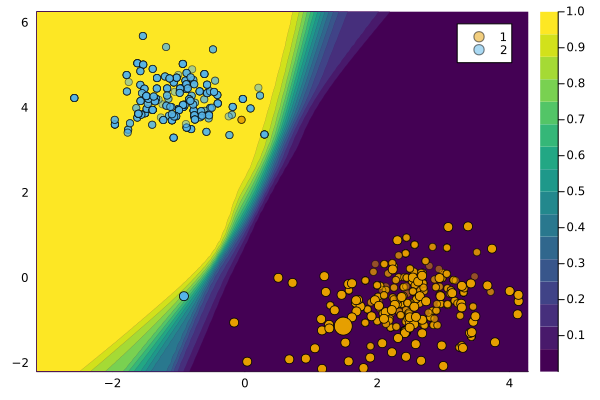

# `GrowingSpheres`

``` markdown
@meta
CurrentModule = CounterfactualExplanations
```

**Growing Spheres** refers to the generator introduced by Laugel et al. (2017). Our implementation takes inspiration from the [CARLA library](https://github.com/carla-recourse/CARLA).

## Principle of the Proposed Approach

In order to interpret a prediction through comparison, the Growing Spheres algorithm focuses on finding an observation belonging to the other class and answers the question: “Considering an observation and a classifier, what is the minimal change we need to apply in order to change the prediction of this observation?”. This problem is similar to inverse classification but applied to interpretability.

Explaining how to change a prediction can help the user understand what the model considers as locally important. The Growing Spheres approach provides insights into the classifier’s behavior without claiming any causal knowledge. It differs from other interpretability approaches and is not concerned with the global behavior of the model. Instead, it aims to provide local insights into the classifier’s decision-making process.

The algorithm finds the closest “ennemy” observation, which is an observation classified into the other class than the input observation. The final explanation is the difference vector between the input observation and the ennemy.

## Finding the Closest Ennemy

The algorithm solves the following minimization problem to find the closest ennemy:

``` math
e^* = \arg \min_{e \in X} \{ c(x, e) \,|\, f(e) \neq f(x) \}
```

The cost function `c(x, e)` is defined as:

``` math
c(x, e) = ||x - e||_2 + \gamma ||x - e||_0
```

where `||.||_2` is the Euclidean norm and `||.||_0` is the sparsity measure. The weight `gamma` balances the importance of sparsity in the cost function.

To approximate the solution, the Growing Spheres algorithm uses a two-step heuristic approach. The first step is the Generation phase, where observations are generated in spherical layers around the input observation. The second step is the Feature Selection phase, where the generated observation with the smallest change in each feature is selected.

## Example

``` julia
generator = GrowingSpheresGenerator()
M = fit_model(counterfactual_data, :DeepEnsemble)
ce = generate_counterfactual(
    x, target, counterfactual_data, M, generator)
plot(ce)
```



## References

Laugel, Thibault, Marie-Jeanne Lesot, Christophe Marsala, Xavier Renard, and Marcin Detyniecki. 2017. “Inverse Classification for Comparison-Based Interpretability in Machine Learning.” arXiv. <https://doi.org/10.48550/arXiv.1712.08443>.
