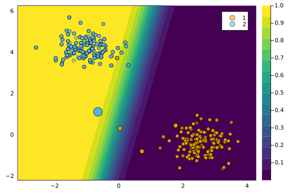
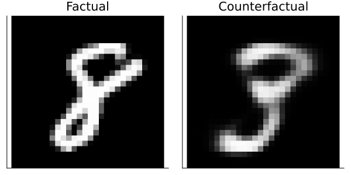

``` @meta
CurrentModule = CounterfactualExplanations 
```

# `REVISEGenerator`

REVISE is a Latent Space generator introduced by Joshi et al. (2019).

## Description

The current consensus in the literature is that Counterfactual Explanations should be realistic: the generated counterfactuals should look like they were generated by the data-generating process (DGP) that governs the problem at hand. With respect to Algorithmic Recourse, it is certainly true that counterfactuals should be realistic in order to be actionable for individuals.[1] To address this need, researchers have come up with various approaches in recent years. Among the most popular approaches is **Latent Space Search**, which was first proposed in Joshi et al. (2019): instead of traversing the feature space directly, this approach relies on a separate generative model that learns a latent space representation of the DGP. Assuming the generative model is well-specified, access to the learned latent embeddings of the data comes with two **advantages**:

1.  Since the learned DGP is encoded in the latent space, the generated counterfactuals will respect the learned representation of the data. In practice, this means that counterfactuals will be realistic.
2.  The latent space is typically a compressed (i.e. lower dimensional) version of the feature space. This makes the counterfactual search less costly.

There are also certain **disadvantages** though:

1.  Learning generative models is (typically) an expensive task, which may well outweigh the benefits associated with utlimately traversing a lower dimensional space.
2.  If the generative model is poorly specified, this will affect the quality of the counterfactuals.[2]

Anyway, traversing latent embeddings is a powerful idea that may be very useful depending on the specific context. This tutorial introduces the concept and how it is implemented in this package.

## Usage

The approach can be used in our package as follows:

``` julia
generator = REVISEGenerator()
ce = generate_counterfactual(x, target, counterfactual_data, M, generator)
plot(ce)
```



### 3D Example

To illustrate the notion of Latent Space search, let’s look at an example involving 3-dimensional input data, which we can still visualize. The code chunk below loads the data and implements the counterfactual search.

``` julia
# Data and Classifier:
counterfactual_data = load_blobs(k=3)
X = counterfactual_data.X
ys = counterfactual_data.output_encoder.labels.refs
M = fit_model(counterfactual_data, :MLP)

# Randomly selected factual:
x = select_factual(counterfactual_data,rand(1:size(counterfactual_data.X,2)))
y = predict_label(M, counterfactual_data, x)[1]
target = counterfactual_data.y_levels[counterfactual_data.y_levels .!= y][1]

# Generate recourse:
ce = generate_counterfactual(x, target, counterfactual_data, M, generator)
```

The figure below demonstrates the idea of searching counterfactuals in a lower-dimensional latent space: on the left, we can see the counterfactual search in the 3-dimensional feature space, while on the right we can see the corresponding search in the latent space.


## MNIST data

Let’s carry the ideas introduced above over to a more complex example. The code below loads MNIST data as well as a pre-trained classifier and generative model for the data.

``` julia
using CounterfactualExplanations.Models: load_mnist_mlp, load_mnist_ensemble, load_mnist_vae
using Images
using MLDatasets
using MLDatasets: convert2image
counterfactual_data = load_mnist()
X, y = CounterfactualExplanations.DataPreprocessing.unpack_data(counterfactual_data)
input_dim, n_obs = size(counterfactual_data.X)
M = load_mnist_mlp()
vae = load_mnist_vae()
```

The F1-score of our pre-trained image classifier on test data is: 0.96

Before continuing, we supply the pre-trained generative model to our data container:

``` julia
counterfactual_data.generative_model = vae # assign generative model
```

Now let’s define a factual and target label:

``` julia
# Randomly selected factual:
factual_label = 8
x = reshape(X[:,rand(findall(predict_label(M, counterfactual_data).==factual_label))],input_dim,1)
target = 3
factual = predict_label(M, counterfactual_data, x)[1]
```

Using REVISE, we are going to turn a randomly drawn 8 into a 3.

The API call is the same as always:

``` julia
γ = 0.95
# Define generator:
generator = REVISEGenerator(
  opt = Descent(0.1),
  decision_threshold = γ,
  λ=0.01
)
# Generate recourse:
ce = generate_counterfactual(x, target, counterfactual_data, M, generator)
```

The chart below shows the results:



## References

Joshi, Shalmali, Oluwasanmi Koyejo, Warut Vijitbenjaronk, Been Kim, and Joydeep Ghosh. 2019. “Towards Realistic Individual Recourse and Actionable Explanations in Black-Box Decision Making Systems.” <https://arxiv.org/abs/1907.09615>.

[1] In general, we believe that there may be a trade-off between creating counterfactuals that respect the DGP vs. counterfactuals reflect the behaviour of the black-model in question - both accurately and complete.

[2] We believe that there is another potentially crucial disadvantage of relying on a separate generative model: it reallocates the task of learning realistic explanations for the data from the black-box model to the generative model.
