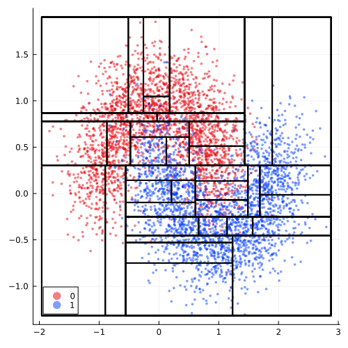

``` @meta
CurrentModule = CounterfactualExplanations 
```

# T-CREx Generator

The T-CREx is a novel model-agnostic counterfactual generator that can be used to generate local and global Counterfactual Rule Explanations (CREx) Bewley, I. Amoukou, et al. (2024).

!!! warning "Breaking Changes Expected"
    Work on this feature is still in its very early stages and breaking changes should be expected. The introduction of this new generator introduces new concepts such as global counterfactual explanations that are not explained anywhere else in this documentation. If you want to use this generator, please make sure you are familiar with the related literature. 

## Usage

The implementation of the `TCRExGenerator` depends on [DecisionTree.jl](https://github.com/JuliaAI/DecisionTree.jl). For the time being, we have decided to not add a strong dependency on DecisionTree.jl to the package. Instead, the functionality of the `TCRExGenerator` is made available through the `DecisionTreeExt` extension, which will be loaded conditionally on loading the [DecisionTree.jl](https://github.com/JuliaAI/DecisionTree.jl) (see [Julia docs](https://pkgdocs.julialang.org/v1/creating-packages/#Conditional-loading-of-code-in-packages-(Extensions)) for more details extensions):

``` julia
using DecisionTree
```

Let us first load set up the problem by loading some data, fitting a simple model and determining a target and factual class:

``` julia
# Counteractual data and model:
n = 3000
data = CounterfactualData(load_moons(n; noise=0.25)...)
X = data.X
M = fit_model(data, :MLP)
fx = predict_label(M, data)
target = 1
factual = 0
chosen = rand(findall(predict_label(M, data) .== factual))
x = select_factual(data, chosen)
```

Next, we instantiate the generator much like any other counterfactual generator in our package:

``` julia
ρ = 0.02        # feasibility threshold (see Bewley et al. (2024))
τ = 0.9         # accuracy threshold (see Bewley et al. (2024))
generator = Generators.TCRExGenerator(ρ=ρ, τ=τ)
```

Finally, we can use the `TCRExGenerator` instance to generate a (global) counterfactual rule epxlanation (CRE) for the given target, data and model as follows:

``` julia
cre = generator(target, data, M)        # counterfactual rule explanation (global)
```

The CRE can be applied to our factual `x` to derive a (local) counterfactual point explanation (CPE):

``` julia
idx, optimal_rule = cre(x)              # counterfactual point explanation (local)
```

## Worked Example from Bewley, I. Amoukou, et al. (2024)

To make better sense of this, we will now go through the worked example presented in Bewley, I. Amoukou, et al. (2024). For this purpose, we need to make the functions of the `DecisionTreeExt` extension available.

!!! warning "Private API"
    Please note that of the `DecisionTreeExt` extension is loaded here purely for demonstrative purposes. You should not load the extension like this in your own work.

``` julia
DTExt = Base.get_extension(CounterfactualExplanations, :DecisionTreeExt)
```

### (a) Tree-based surrogate model

In the first step, we train a tree-based surrogate model based on the data and the black-box model `M`. Specifically, the surrogate model is trained on pairs of observed input data and the labels predicted by the black-box model: $\{(x, M(x))\}_{1\leq i \leq n}$. Following Bewley, I. Amoukou, et al. (2024), we impose a minimum number of samples per leaf to ensure counterfactual *feasibility* (also often referred to as *plausibility*). This number is computed under the hood and based on the `generator.ρ` field of the `TCRExGenerator`, which can be used to specify the minimum fraction of all samples that is contained by any given rule.

``` julia
# Surrogate:
model, fitresult = DTExt.grow_surrogate(generator, data, M)
M_sur = CounterfactualExplanations.DecisionTreeModel(model; fitresult=fitresult)
plot(M_sur, data; ms=3, markerstrokewidth=0, size=(500, 500), colorbar=false)
```



We can reassure ourselves that the feasibility constraint is indeed respected:

``` julia
# Extract rules:
R = DTExt.extract_rules(fitresult[1])

# Compute feasibility and accuracy:
feas = DTExt.rule_feasibility.(R, (X,))
@assert minimum(feas) >= ρ
@info "Minimum fraction of samples across all rules is $(round(minimum(feas), digits=3))"
acc_factual = DTExt.rule_accuracy.(R, (X,), (fx,), (factual,))
acc_target = DTExt.rule_accuracy.(R, (X,), (fx,), (target,))
@assert all(acc_target .+ acc_factual .== 1.0)
```

### (b) Maximal-valid rules

From the complete set of rules derived from the surrogate tree, we can derive the maximal-valid rules next. Intuitively, “a maximal-valid rule is one that cannot be made any larger without violating the validity conditions”, where validity is defined in terms of both *feasibility* (`generator.ρ`) and accuracy (`generator.τ`).

``` julia
R_max = DTExt.max_valid(R, X, fx, target, τ)
feas_max = DTExt.rule_feasibility.(R_max, (X,))
acc_max = DTExt.rule_accuracy.(R_max, (X,), (fx,), (target,))
plt = plot(data; ms=3, markerstrokewidth=0, size=(500, 500))
p1 = deepcopy(plt)
rectangle(w, h, x, y) = Shape(x .+ [0,w,w,0], y .+ [0,0,h,h])
for (i, rule) in enumerate(R_max)
    ubx, uby = minimum([rule[1][2], maximum(X[1, :])]),
    minimum([rule[2][2], maximum(X[2, :])])
    lbx, lby = maximum([rule[1][1], minimum(X[1, :])]),
    maximum([rule[2][1], minimum(X[2, :])])
    _feas = round(feas_max[i]; digits=2)
    _n = Int(round(feas_max[i] * n; digits=2))
    _acc = round(acc_max[i]; digits=2)
    @info "Rectangle R$i with feasibility $(_feas) (n≈$(_n)) and accuracy $(_acc)"
    lab = "R$i (ρ̂=$(_feas), τ̂=$(_acc))"
    plot!(p1, rectangle(ubx-lbx,uby-lby,lbx,lby), opacity=.5, color=i+2, label=lab)
end
p1
```


### (c) Induced grid partition

Based on the set of maximal-valid rules, we compute and plot the induced grid partition below.

``` julia
_grid = DTExt.induced_grid(R_max)
p2 = deepcopy(p1)
function plot_grid!(p)
    for (i, (bounds_x, bounds_y)) in enumerate(_grid)
        lbx, ubx = bounds_x
        lby, uby  = bounds_y
        lbx = maximum([lbx, minimum(X[1, :])])
        lby = maximum([lby, minimum(X[2, :])])
        ubx = minimum([ubx, maximum(X[1, :])])
        uby = minimum([uby, maximum(X[2, :])])
        plot!(
            p,
            rectangle(ubx - lbx, uby - lby, lbx, lby);
            fillcolor="black",
            fillalpha=0.1,
            label=nothing,
            lw=2,
        )
    end
end
plot_grid!(p2)
p2
```


### (d) Grid cell prototypes

Next, we pick prototypes from each cell in the induced grid. By setting `pick_arbitrary=false` here we enfore that prototypes correspond to cell centroids, which is not necessary. For each prototype, we compute the corresponding CRE, which is indicated by the color of the large markers in the figure below:

``` julia
xs = DTExt.prototype.(_grid, (X,); pick_arbitrary=false)
Rᶜ = DTExt.cre.((R_max,), xs, (X,); return_index=true) 
p3 = deepcopy(p2)
scatter!(p3, eachrow(hcat(xs...))..., ms=10, label=nothing, color=Rᶜ.+2)
p3
```


### (e) - (f) Global CE representation

Based on the prototypes and their corresponding rule assignments, we fit a CART classification tree with restricted feature thresholds. Specificically, features thresholds are restricted to the partition bounds induced by the set of maximal-valid rules as in Bewley, I. Amoukou, et al. (2024). The figure below shows the resulting global CE representation (i.e. the metarules).

``` julia
bounds = DTExt.partition_bounds(R_max)
tree = DTExt.classify_prototypes(hcat(xs...)', Rᶜ, bounds)
R_final, labels = DTExt.extract_leaf_rules(tree) 
p4 = deepcopy(plt)
for (i, rule) in enumerate(R_final)
    ubx, uby = minimum([rule[1][2], maximum(X[1, :])]),
    minimum([rule[2][2], maximum(X[2, :])])
    lbx, lby = maximum([rule[1][1], minimum(X[1, :])]),
    maximum([rule[2][1], minimum(X[2, :])])
    plot!(
        p4,
        rectangle(ubx - lbx, uby - lby, lbx, lby);
        fillalpha=0.5,
        label=nothing,
        color=labels[i] + 2
    )
end
p4
```


### (g) Local CE example

To generate a local explanation based on the global CE representation, we simply apply the CART decision tree classifier from the previous step to our factual:

``` julia
optimal_rule = apply_tree(tree, vec(x))
p5 = deepcopy(p2)
scatter!(p5, [x[1]], [x[2]], ms=10, color=2+optimal_rule, label="Local CE (move to R$optimal_rule)")
p5
```


## References

Bewley, Tom, Salim I. Amoukou, Saumitra Mishra, Daniele Magazzeni, and Manuela Veloso. 2024. “Counterfactual Metarules for Local and Global Recourse.” <https://arxiv.org/abs/2405.18875>.

Bewley, Tom, Salim I. Amoukou, Saumitra Mishra, Daniele Magazzeni, and Manuela Veloso. 2024. “Counterfactual Metarules for Local and Global Recourse.” In *Proceedings of the 41st International Conference on Machine Learning*, edited by Ruslan Salakhutdinov, Zico Kolter, Katherine Heller, Adrian Weller, Nuria Oliver, Jonathan Scarlett, and Felix Berkenkamp, 235:3707–24. Proceedings of Machine Learning Research. PMLR. <https://proceedings.mlr.press/v235/bewley24a.html>.
