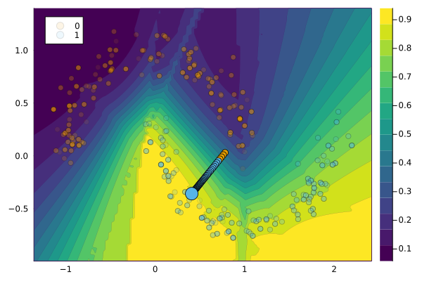

``` @meta
CurrentModule = CounterfactualExplanations 
```

# [LaplaceRedux.jl](https://github.com/JuliaTrustworthyAI/LaplaceRedux.jl)

[LaplaceRedux.jl](https://github.com/JuliaTrustworthyAI/LaplaceRedux.jl) is one of Taija’s own packages that provides a framework for Effortless Bayesian Deep Learning through Laplace Approximation for Flux.jl neural networks. The methodology was first proposed by Immer, Korzepa, and Bauer (2020) and implemented in Python by Daxberger et al. (2021). This is relevant to the work on counterfactual explanations (CE), because research has shown that counterfactual explanations for Bayesian models are typically more plausible, because Bayesian models are able to capture the uncertainty in the data (Schut et al. 2021).

!!! tip "Read More"
    To learn more about Laplace Redux, head over to the [official documentation](https://juliatrustworthyai.github.io/LaplaceRedux.jl/stable/).

## Example

The extension will be loaded automatically when loading the `LaplaceRedux` package (assuming the `CounterfactualExplanations` package is also loaded).

``` julia
using LaplaceRedux
```

Next, we will fit a neural network with Laplace Approximation to the moons dataset using our standard package API for doing so. By default, the Bayesian prior is optimized through empirical Bayes using the `LaplaceRedux` package.

``` julia
# Fit model to data:
data = CounterfactualData(load_moons()...)
M = fit_model(data, :LaplaceRedux; n_hidden=16)
```

    LaplaceReduxExt.LaplaceReduxModel(Laplace(Chain(Dense(2 => 16, relu), Dense(16 => 2)), :classification, :all, nothing, :full, LaplaceRedux.Curvature.GGN(Chain(Dense(2 => 16, relu), Dense(16 => 2)), :classification, Flux.Losses.logitcrossentropy, Array{Float32}[[-1.3098596 0.59241515; 0.91760206 0.02950162; … ; -0.018356863 0.12850936; -0.5381665 -0.7872097], [-0.2581085, -0.90997887, -0.5418944, -0.23735572, 0.81020063, -0.3033359, -0.47902864, -0.6432098, -0.038013518, 0.028280666, 0.009903266, -0.8796683, 0.41090682, 0.011093224, -0.1580453, 0.7911349], [3.092321 -2.4660816 … -0.3446268 -1.465249; -2.9468734 3.167357 … 0.31758657 1.7140366], [-0.3107697, 0.31076983]], 1.0, :all, nothing), 1.0, 0.0, Float32[-1.3098596, 0.91760206, 0.5239727, -1.1579771, -0.851813, -1.9411169, 0.47409698, 0.6679365, 0.8944433, 0.663116  …  -0.3172857, 0.15530388, 1.3264753, -0.3506721, -0.3446268, 0.31758657, -1.465249, 1.7140366, -0.3107697, 0.31076983], [0.10530027048093525 0.0 … 0.0 0.0; 0.0 0.10530027048093525 … 0.0 0.0; … ; 0.0 0.0 … 0.10530027048093525 0.0; 0.0 0.0 … 0.0 0.10530027048093525], [0.10066431429751965 0.0 … -0.030656783425475176 0.030656334963944154; 0.0 20.93513766443357 … -2.3185940232360736 2.3185965484008193; … ; -0.030656783425475176 -2.3185940232360736 … 1.0101450999063672 -1.0101448118057204; 0.030656334963944154 2.3185965484008193 … -1.0101448118057204 1.0101451389641771], [1.1006643142975197 0.0 … -0.030656783425475176 0.030656334963944154; 0.0 21.93513766443357 … -2.3185940232360736 2.3185965484008193; … ; -0.030656783425475176 -2.3185940232360736 … 2.0101450999063672 -1.0101448118057204; 0.030656334963944154 2.3185965484008193 … -1.0101448118057204 2.010145138964177], [0.9412600568016627 0.003106911671721699 … 0.003743740333409532 -0.003743452315572739; 0.003106912946573237 0.6539263732691709 … 0.0030385955287734246 -0.0030390041204196414; … ; 0.0037437406323562283 0.003038591829991259 … 0.9624905710233649 0.03750911813897676; -0.0037434526145225856 -0.0030390004216833593 … 0.03750911813898124 0.9624905774453485], 82, 250, 2, 997.8087484836578), :classification_multi)

Finally, we select a factual instance and generate a counterfactual explanation for it using the generic gradient-based CE method.

``` julia
# Select a factual instance:
target = 1
factual = 0
chosen = rand(findall(predict_label(M, data) .== factual))
x = select_factual(data, chosen)

# Generate counterfactual explanation:
η = 0.01
generator = GenericGenerator(; opt=Descent(η), λ=0.01)
conv = CounterfactualExplanations.Convergence.DecisionThresholdConvergence(;
    decision_threshold=0.9, max_iter=100
)
ce = generate_counterfactual(x, target, data, M, generator; convergence=conv)
plot(ce, alpha=0.1)
```



# References

Daxberger, Erik, Agustinus Kristiadi, Alexander Immer, Runa Eschenhagen, Matthias Bauer, and Philipp Hennig. 2021. “Laplace Redux-Effortless Bayesian Deep Learning.” *Advances in Neural Information Processing Systems* 34.

Immer, Alexander, Maciej Korzepa, and Matthias Bauer. 2020. “Improving Predictions of Bayesian Neural Networks via Local Linearization.” <https://arxiv.org/abs/2008.08400>.

Schut, Lisa, Oscar Key, Rory Mc Grath, Luca Costabello, Bogdan Sacaleanu, Yarin Gal, et al. 2021. “Generating Interpretable Counterfactual Explanations By Implicit Minimisation of Epistemic and Aleatoric Uncertainties.” In *International Conference on Artificial Intelligence and Statistics*, 1756–64. PMLR.
