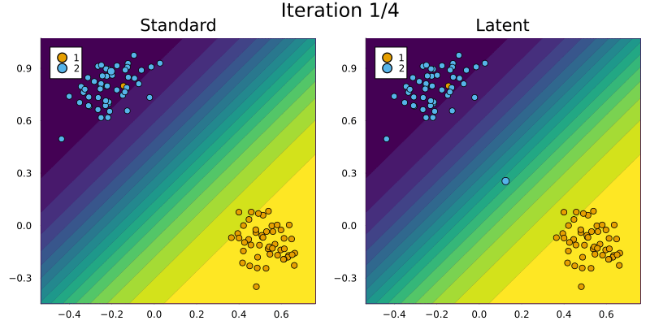
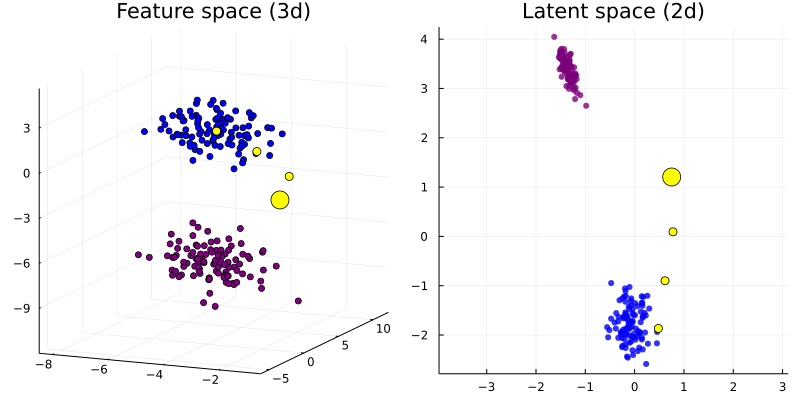
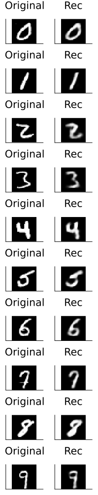
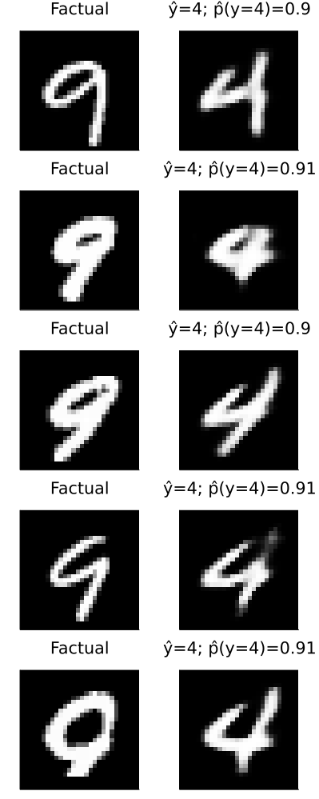

``` @meta
CurrentModule = CounterfactualExplanations 
```

# Latent Space Search

The current consensus in the literature is that Counterfactual Explanations should realistic: the generated counterfactuals should look like they were generated by the data generating process (DGP) that governs the problem at hand. With respect to Algorithmic Recourse it is certainly true that counterfactuals should be realistic in order to be actionable for individuals.[1] To address this need, researchers have come up with various different approaches in recent years. Among the most popular approaches is **Latent Space Search**, which was first proposed in Joshi et al. (2019): instead of traversing the feature space directly, this approach relies on a separate generative model that learns a latent space representation of the DGP. Assuming the generative model is well-specified, access to the learned latent embeddings of the data comes with two **advantages**:

1.  Since the learned DGP is encoded in the latent space, the generated counterfactuals will respect the learned representation of the data. In practice this means that counterfactuals will be realistic.
2.  The latent space is typically a compressed (i.e. lower dimensional) version of the feature space. This makes the counterfactual search less costly.

There are also certain **disadvantages** though:

1.  Learning generative models is (typically) an expensive task, which may well outweigh the benefits associated with utlimately traversing a lower dimensional space.
2.  If the generative model is poorly specified, this will affect the quality of the counterfactuals.[2]

Anyway, traversing latent embeddings is a powerful idea that may be very useful depending on the specific context. This tutorial introduces the concept and how it is implemented in this package.

## Synthetic data

We start by looking at synthetic data.

### 2D Example

The first few code snippets below generate the synthetic data, set up a simple neural network in Flux and train it for the binary classification task.

``` julia
using CounterfactualExplanations
using Random
input_dim = 2
n = 100
η = 3
μ₀ = rand(-input_dim:input_dim,input_dim) .* η
μ₁ = rand(-input_dim:input_dim,input_dim) .* η
X₀ = μ₀ .+ randn(input_dim, n) 
X₁ = μ₁ .+ randn(input_dim, n) 
X = hcat(X₀, X₁)
using MLUtils
xs = MLUtils.unstack(X,dims=2)
ys = hcat(zeros(1,n), ones(1,n))
```

``` julia
using Flux
n_hidden = 50
nn = Chain(
    Dense(input_dim, n_hidden, relu),
    Dense(n_hidden, 1)
)  
loss(x, y) = Flux.Losses.logitbinarycrossentropy(nn(x), y)
data = zip(xs,ys)
```

``` julia
using Flux.Optimise: update!, ADAM
opt = ADAM()
epochs = 100
using Statistics: mean
avg_loss(data) = mean(map(d -> loss(d[1],d[2]), data))
show_every = epochs/10

for epoch = 1:epochs
  for d in data
    gs = gradient(Flux.params(nn)) do
      l = loss(d...)
    end
    update!(opt, Flux.params(nn), gs)
  end
  if epoch % show_every == 0
    println("Epoch " * string(epoch))
    @show avg_loss(data)
  end
end

M = FluxModel(nn)
```

We then draw a random factual and generate two counterfactuals - one using generic search in the feature space and one using generic search in the latent space. The default generative model - a Variational Autoencoder (VAE) - is set up and trained under the hood. The resulting counterfactual paths are shown in the animation below: note how latent space search results in faster convergence to an optimum that sits right within the cluster of samples in the target class. For generic search in the feature space we instead end up just crossing the decision boundary before converging.

``` julia
counterfactual_data = CounterfactualData(X,ys)
using Random
# Random.seed!(123)
x = select_factual(counterfactual_data, rand(1:size(X)[2])) 
y = round(probs(M, x)[1])
target = ifelse(y==1.0,0.0,1.0) # opposite label as target
```

``` julia
# Define generator:
generator = GenericGenerator()
# Generate recourse:
counterfactual = generate_counterfactual(x, target, counterfactual_data, M, generator, latent_space=false)
counterfactual_latent = generate_counterfactual(x, target, counterfactual_data, M, generator, latent_space=true)
```



### 3D Example

This second example is largely analogous to what we just saw above. The figure below demonstrates the idea of searching counterfactuals in a lower dimensional latent space.

``` julia
using CounterfactualExplanations
using Random
input_dim = 3
n = 100
η = 3
μ₀ = rand(-input_dim:input_dim,input_dim) .* η
μ₁ = rand(-input_dim:input_dim,input_dim) .* η
X₀ = μ₀ .+ randn(input_dim, n) 
X₁ = μ₁ .+ randn(input_dim, n) 
X = hcat(X₀, X₁)
using MLUtils
xs = MLUtils.unstack(X,dims=2)
ys = hcat(zeros(1,n), ones(1,n))
```

``` julia
using Flux
n_hidden = 50
nn = Chain(
    Dense(input_dim, n_hidden, relu),
    Dense(n_hidden, 1)
)  
loss(x, y) = Flux.Losses.logitbinarycrossentropy(nn(x), y)
data = zip(xs,ys)
```

``` julia
using Flux.Optimise: update!, ADAM
opt = ADAM()
epochs = 100
using Statistics: mean
avg_loss(data) = mean(map(d -> loss(d[1],d[2]), data))
show_every = epochs/10

for epoch = 1:epochs
  for d in data
    gs = gradient(Flux.params(nn)) do
      l = loss(d...)
    end
    update!(opt, Flux.params(nn), gs)
  end
  if epoch % show_every == 0
    println("Epoch " * string(epoch))
    @show avg_loss(data)
  end
end

M = FluxModel(nn)
```

``` julia
counterfactual_data = CounterfactualData(X,ys)
```

``` julia
using Random
Random.seed!(123)
x = select_factual(counterfactual_data, rand(1:size(X)[2])) 
y = round(probs(M, x)[1])
target = ifelse(y==1.0,0.0,1.0) # opposite label as target
```

``` julia
# Define generator:
generator = GenericGenerator()
# Generate recourse:
counterfactual = generate_counterfactual(x, target, counterfactual_data, M, generator, latent_space=true)
```



## MNIST data

Finally, let’s take the ideas introduced above to a more complex example. We first load the MNIST data and a simple pre-trained neural network. The test set accuracy is shown below.

``` julia
using Flux
using CounterfactualExplanations.Data: mnist_data, mnist_model
X, ys = mnist_data()
model = mnist_model()
ensemble = mnist_ensemble()
M = FluxModel(model, type=:classification_multi)
```

``` julia
using MLDatasets
data_test = MNIST(:test)
test_x, test_y = data_test[:]
ys_test = Flux.onehotbatch(test_y, 0:9)
X_test = Flux.flatten(test_x)
bs = Int(round(size(X)[2]/10))
data_test = DataLoader((X_test,ys_test),batchsize=bs)
accuracy(data) = mean(map(d -> mean(Flux.onecold(Flux.softmax(model(d[1])), 0:9) .== Flux.onecold(d[2], 0:9)), data))
accuracy(data_test)
```

### Training the VAE

Here we show how a custom generative model can be trained …

``` julia
input_dim = size(X)[1]
using CounterfactualExplanations.GenerativeModels: VAE, train!
vae = VAE(input_dim; nll=Flux.logitbinarycrossentropy, epochs=100, λ=0.0001, latent_dim=28)
train!(vae, X, ys)
using BSON: @save
@save joinpath(www_path, "vae.bson") vae
```

``` julia
draw_mnist(i) = reshape(X[:,rand(findall(Flux.onecold(ys,0:9).==i))],input_dim,1)
reconstruct_mnist(x) = σ.(CounterfactualExplanations.GenerativeModels.reconstruct(vae,x)[1]) reshape_mnist(x) = reshape(x,28,28)
plt_list = []
for i in 0:9
  x = draw_mnist(i)
  x_rec = reconstruct_mnist(x)
  img = plot(convert2image(MNIST,reshape_mnist(x)), title="Original", axis=nothing)
  img_rec = plot(convert2image(MNIST,reshape_mnist(x_rec)), title="Rec", axis=nothing)
  plt = plot(img, img_rec)
  plt_list = vcat(plt_list, plt)
end
plt = plot(plt_list..., layout=(10,1), size=(200,1000))
savefig(plt, joinpath(www_path, "vae_reconstruct.png"))
```

… and supplied to an instance of type `CounterfactualData`. The figure below shows randomly selected MNIST images (left) and their reconstructions (right).

``` julia
counterfactual_data = CounterfactualData(X,ys)
counterfactual_data.generative_model = vae # assign generative model
```



### Counterfactual search

Since the image reconstructions are decent, we can expect the counterfactual search through the latent embedding to yield realistic counterfactuals. Below we put this to the test: we select a random nine (9) and use generic search in the latent space to generate a four (4). Note, that we have set the threshold probability to 90% and we have chosen not to penalize the distance of the counterfactual from its factual. The result shown in the figure below is convincing.

``` julia
# Randomly selected factual:
factual = 10
using Random
Random.seed!(1234)
x = reshape(X[:,rand(findall(Flux.onecold(ys,1:10).==factual))],input_dim,1)
target = 5
γ = 0.90
```

``` julia
# Define generator:
generator = GenericGenerator(;ϵ=1.0,λ=0.0)
# Generate recourse:
counterfactual = generate_counterfactual(x, target, counterfactual_data, M, generator, latent_space=true, γ=γ)
```

``` julia
p1 = plot(convert2image(MNIST, reshape(x,28,28)),axis=nothing, title="Factual")
target_prob = round(target_probs(counterfactual)[1],digits=2)
ŷ = CounterfactualExplanations.Counterfactuals.counterfactual_label(counterfactual)[1]-1
p2 = plot(
  convert2image(MNIST, reshape(counterfactual.f(counterfactual.s′),28,28)),
  axis=nothing,title="ŷ=$(ŷ); p̂(y=$(target-1))=$(target_prob)"
)
plt = plot(p1,p2,size=(500,200))
savefig(plt, joinpath(www_path, "mnist_$(factual-1)to$(target-1)_latent.png"))
```

``` julia
# Generate recourse:
counterfactual = generate_counterfactual(x, target, counterfactual_data, M, generator, latent_space=false, γ=0.95)
```

``` julia
p1 = plot(convert2image(MNIST, reshape(x,28,28)),axis=nothing, title="Factual")
target_prob = round(target_probs(counterfactual)[1],digits=2)
ŷ = CounterfactualExplanations.Counterfactuals.counterfactual_label(counterfactual)[1]-1
p2 = plot(
  convert2image(MNIST, reshape(counterfactual.f(counterfactual.s′),28,28)),
  axis=nothing,title="ŷ=$(ŷ); p̂(y=$(target-1))=$(target_prob)"
)
plt = plot(p1,p2,size=(500,200))
savefig(plt, joinpath(www_path, "mnist_$(factual-1)to$(target-1)_wachter.png"))
```



Joshi, Shalmali, Oluwasanmi Koyejo, Warut Vijitbenjaronk, Been Kim, and Joydeep Ghosh. 2019. “Towards Realistic Individual Recourse and Actionable Explanations in Black-Box Decision Making Systems.” *arXiv Preprint arXiv:1907.09615*.

[1] In general, we believe that there may be a trade-off between creating counterfactuals that respect the DGP vs. counterfactuals reflect the behaviour of the black-model in question - both accurately and complete.

[2] We believe that there is another potentially crucial disadvantage of relying on a separate generative model: it reallocates the task of learning realisitic explanations for the data from the black-box model to the generative model.
