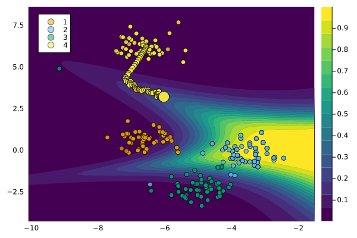

``` @meta
CurrentModule = CounterfactualExplanations 
```

# How to add Custom Models

Adding custom models is possible and relatively straightforward, as we will demonstrate in this guide.

## Custom Models

Apart from the default models you can use any arbitrary (differentiable) model and generate recourse in the same way as before. Only two steps are necessary to make your own Julia model compatible with this package:

1.  The model needs to be declared as a subtype of `<:CounterfactualExplanations.Models.AbstractFittedModel`.
2.  You need to extend the functions `CounterfactualExplanations.Models.logits` and `CounterfactualExplanations.Models.probs` for your custom model.

### How `FluxModel` was added

To demonstrate how this can be done in practice, we will reiterate here how native support for [`Flux.jl`](https://fluxml.ai/) models was enabled (Innes 2018). Once again we use synthetic data for an illustrative example. The code below loads the data and builds a simple model architecture that can be used for a multi-class prediction task. Note how outputs from the final layer are not passed through a softmax activation function, since the counterfactual loss is evaluated with respect to logits. The model is trained with dropout.

``` julia
# Data:
N = 200
data = TaijaData.load_blobs(N; centers=4, cluster_std=0.5)
counterfactual_data = DataPreprocessing.CounterfactualData(data...)
y = counterfactual_data.y
X = counterfactual_data.X

# Flux model setup: 
using Flux
data = Flux.DataLoader((X,y), batchsize=1)
n_hidden = 32
output_dim = size(y,1)
input_dim = 2
activation = σ
model = Chain(
    Dense(input_dim, n_hidden, activation),
    Dropout(0.1),
    Dense(n_hidden, output_dim)
)  
loss(x, y) = Flux.Losses.logitcrossentropy(model(x), y)

# Flux model training:
using Flux.Optimise: update!, Adam
opt = Adam()
epochs = 50
for epoch = 1:epochs
  for d in data
    gs = gradient(Flux.params(model)) do
      l = loss(d...)
    end
    update!(opt, Flux.params(model), gs)
  end
end
```

The code below implements the two steps that were necessary to make Flux models compatible with the package. We first declare our new struct as a subtype of `<:AbstractDifferentiableModel`, which itself is an abstract subtype of `<:AbstractFittedModel`. Computing logits amounts to just calling the model on inputs. Predicted probabilities for labels can in this case be computed by passing predicted logits through the softmax function. Finally, we just instantiate our model in the same way as always.

``` julia
# Step 1)
struct MyFluxModel <: AbstractDifferentiableModel
    model::Any
    likelihood::Symbol
end

# Step 2)
# import functions in order to extend
import CounterfactualExplanations.Models: logits
import CounterfactualExplanations.Models: probs 
logits(M::MyFluxModel, X::AbstractArray) = M.model(X)
probs(M::MyFluxModel, X::AbstractArray) = softmax(logits(M, X))
M = MyFluxModel(model, :classification_multi)
```

The code below implements the counterfactual search and plots the results:

``` julia
factual_label = 4
target = 2
chosen = rand(findall(predict_label(M, counterfactual_data) .== factual_label))
x = select_factual(counterfactual_data, chosen)  

# Counterfactual search:
generator = GenericGenerator()
ce = generate_counterfactual(x, target, counterfactual_data, M, generator)
plot(ce)
```



## References

Innes, Mike. 2018. “Flux: Elegant Machine Learning with Julia.” *Journal of Open Source Software* 3 (25): 602. <https://doi.org/10.21105/joss.00602>.
