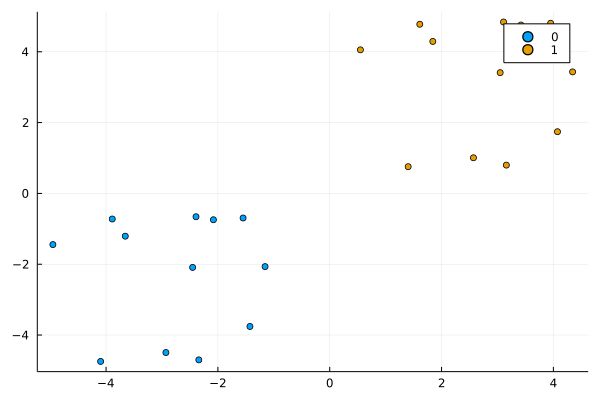
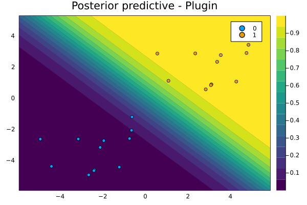
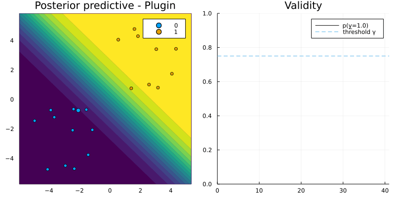
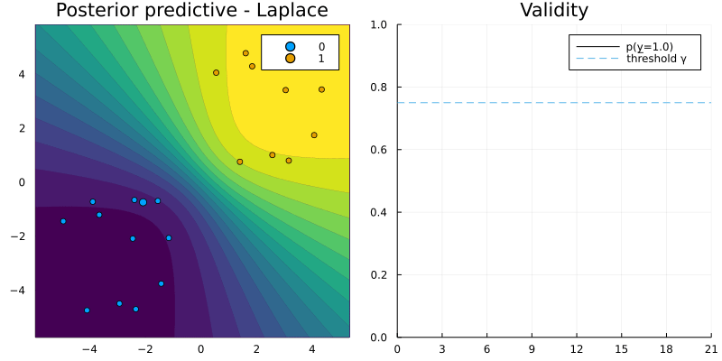

```@meta
CurrentModule = CLEAR 
```

# Recourse for binary targets


```julia
using Flux, Random, Plots, PlotThemes, CLEAR
theme(:wong)
using Logging
disable_logging(Logging.Info)
```


    LogLevel(1)


To understand the core functionality of CLEAR.jl we will look at two example use cases of the `generate_recourse` function. This function takes a structure of type `Generator` as its main argument. Users can utilize one of the [default generators](#default-generators): `GenericGenerator <: Generator`, `GreedyGenerator <: Generator`. Alternatively, users can also create their own [custom generator](#custom-generators). 

## Default generators

### `GenericGenerator`

Let $t\in\{0,1\}$ denote the target label, $M$ the model (classifier) and $\underline{x}\in\mathbb{R}^D$ the vector of counterfactual features. In order to generate recourse the `GenericGenerator` optimizes the following objective function through steepest descent

```math
\underline{x} = \arg \min_{\underline{x}}  \ell(M(\underline{x}),t) + \lambda h(\underline{x})
```

where $\ell$ denotes some loss function targeting the deviation between the target label and the predicted label and $h(\cdot)$ as a complexity penality generally addressing the *realism* or *cost* of the proposed counterfactual. 

Let's generate some toy data:


```julia
# Some random data:
Random.seed!(1234);
N = 25
w = [1.0 1.0]# true coefficients
b = 0
x, y = toy_data_linear(N)
X = hcat(x...)
plt = plot()
plt = plot_data!(plt,X',y);
savefig(plt, "www/binary_samples.png")
```



For this toy data we will now implement algorithmic recourse as follows:

- Use the coefficients `w` and `b` to define our model using `CLEAR.Models.LogisticModel(w, b)`.
- Define our `GenericGenerator`.
- Generate recourse.


```julia
using CLEAR.Models: LogisticModel, probs 
# Logit model:
𝑴 = LogisticModel(w, [b])
# Randomly selected factual:
Random.seed!(123);
x̅ = X[:,rand(1:size(X)[2])]
y̅ = round(probs(𝑴, x̅)[1])
target = ifelse(y̅==1.0,0.0,1.0) # opposite label as target
γ = 0.75 # desired level of confidence
```


    0.75


```julia
plt = plot_contour(X',y,𝑴;title="Posterior predictive - Plugin")
savefig(plt, "www/binary_contour.png");
```




```julia
# Define Generator:
generator = GenericGenerator(0.1,0.1,1e-5,:logitbinarycrossentropy,nothing)
# Generate recourse:
recourse = generate_recourse(generator, x̅, 𝑴, target, γ); # generate recourse
```

Now let's plot the resulting counterfactual path in the 2-D feature space (left) and the predicted probability (right):


```julia
T = size(recourse.path)[1]
X_path = reduce(hcat,recourse.path)
ŷ = CLEAR.target_probs(probs(recourse.𝑴, X_path),target)
p1 = plot_contour(X',y,𝑴;clegend=false, title="Posterior predictive - Plugin")
anim = @animate for t in 1:T
    scatter!(p1, [recourse.path[t][1]], [recourse.path[t][2]], ms=5, color=Int(y̅), label="")
    p2 = plot(1:t, ŷ[1:t], xlim=(0,T), ylim=(0, 1), label="p(y̲=" * string(target) * ")", title="Validity", lc=:black)
    Plots.abline!(p2,0,γ,label="threshold γ", ls=:dash) # decision boundary
    plot(p1,p2,size=(800,400))
end
gif(anim, "www/binary_generic_recourse.gif", fps=25);
```



### `GreedyGenerator`

Next we will repeat the exercise above, but instead use the `GreedyGenerator` in the context of a Bayesian classifier. This generator is greedy in the sense that it simply chooses the most salient feature $\underline{x}[d]$ where $d=\arg\max_{d \in [1,D]} \nabla_{\underline{x}} \ell(M(\underline{x}),t)$ and perturbs it by a fixed amount $\delta$. In other words, optimization is penalty-free. This is possible in the Bayesian context, because maximizing the predictive probability $\gamma$ corresponds to minimizing the predictive uncertainty: by construction the generated counterfactual will therefore be *realistic* (low epistemic uncertainty) and *unambiguous* (low aleotoric uncertainty).


```julia
using LinearAlgebra
Σ = Symmetric(reshape(randn(9),3,3).*0.01 + UniformScaling(1)) # MAP covariance matrix
μ = hcat(b, w)
𝑴 = CLEAR.Models.BayesianLogisticModel(μ, Σ);
generator = GreedyGenerator(0.25,15,:logitbinarycrossentropy,nothing)
recourse = generate_recourse(generator, x̅, 𝑴, target, γ); # generate recourse
```

Once again we plot the resulting counterfactual path (left) and changes in the predicted probability (right). For the Bayesian classifier predicted probabilities splash out: uncertainty increases in regions with few samples. Note how the greedy approach selects the same most salient feature over and over again until its exhausted (i.e. it has been chosen `GreedyGenerator.n` times).


```julia
T = size(recourse.path)[1]
X_path = reduce(hcat,recourse.path)
ŷ = CLEAR.target_probs(probs(recourse.𝑴, X_path),target)
p1 = plot_contour(X',y,𝑴;clegend=false, title="Posterior predictive - Laplace")
anim = @animate for t in 1:T
    scatter!(p1, [recourse.path[t][1]], [recourse.path[t][2]], ms=5, color=Int(y̅), label="")
    p2 = plot(1:t, ŷ[1:t], xlim=(0,T), ylim=(0, 1), label="p(y̲=" * string(target) * ")", title="Validity", lc=:black)
    Plots.abline!(p2,0,γ,label="threshold γ", ls=:dash) # decision boundary
    plot(p1,p2,size=(800,400))
end
gif(anim, "www/binary_greedy_recourse.gif", fps=25);
```


