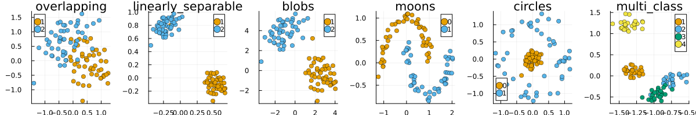

``` @meta
CurrentModule = CounterfactualExplanations 
```

# Data Catalogue

To allow researchers and practitioners to test and compare counterfactual generators, the package ships with pre-processed synthetic and real-world benchmark datasets from different domains.

## Synthetic Data

The following dictionary can be used to inspect the available methods to generate synthetic datasets where the `key` indicates the name of the data and the `value` is the corresponding method:

``` julia
data_catalogue[:synthetic]
```

    Dict{Symbol, Function} with 6 entries:
      :overlapping        => load_overlapping
      :linearly_separable => load_linearly_separable
      :blobs              => load_blobs
      :moons              => load_moons
      :circles            => load_circles
      :multi_class        => load_multi_class

The chart below shows the generated data using default parameters:

``` julia
plts = []
_height = 200
_n = length(keys(data_catalogue[:synthetic]))
for (key, fun) in data_catalogue[:synthetic]
    counterfactual_data = fun()
    plt = plot()
    scatter!(counterfactual_data, title=key)
    plts = [plts..., plt]
end
plot(plts..., size=(_n * _height, _height), layout=(1, _n))
```



## Real-World Data

As for real-world data, the same dictionary can be used to inspect the available data from different domains.

``` julia
data_catalogue[:tabular]
```

    Dict{Symbol, Function} with 3 entries:
      :california_housing => load_california_housing
      :credit_default     => load_credit_default
      :gmsc               => load_gmsc

``` julia
data_catalogue[:vision]
```

    Dict{Symbol, Function} with 3 entries:
      :fashion_mnist => load_fashion_mnist
      :mnist         => load_mnist
      :cifar_10      => load_cifar_10

## Loading Data

To load or generate any of the datasets listed above, you can just use the corresponding method, for example:

``` julia
counterfactual_data = load_linearly_separable()
```

Optionally, you can specify how many samples you want to generate like so:

``` julia
n = 100
counterfactual_data = load_overlapping(n)
```

This also applies to real-world datasets, which by default are loaded in their entirety. If `n` is supplied, the dataset will be randomly undersampled:

``` julia
counterfactual_data = load_mnist(n)
```

The undersampled dataset is automatically balanced:

``` julia
sum(counterfactual_data.y; dims=2)
```

    10×1 Matrix{Int64}:
     10
     10
     10
     10
     10
     10
     10
     10
     10
     10

We can also use a helper function to split the data into train and test sets:

``` julia
train_data, test_data = 
    CounterfactualExplanations.DataPreprocessing.train_test_split(counterfactual_data)
```
