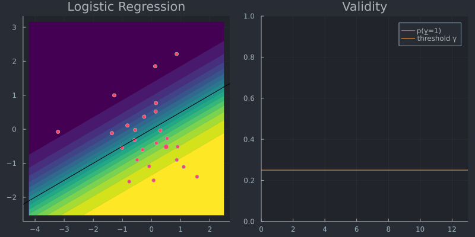
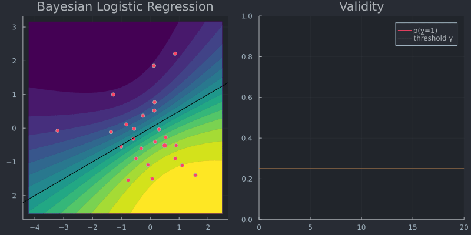

```@meta
CurrentModule = AlgorithmicRecourse 
```


```julia
using Flux
using Random
using Plots
using PlotThemes
theme(:juno)
using Logging
disable_logging(Logging.Info)
```


    LogLevel(1)


# Generating recourse

To understand the core functionality of AlgorithmicRecourse.jl we will look at two example use cases of the `generate_recourse` function. This function takes a structure of type `Generator` as its main argument. Users can utilize one of the [default generators](#default-generators): `GenericGenerator <: Generator`, `GreedyGenerator <: Generator`. Alternatively, users can also create their own [custom generator](#custom-generators). 

```@docs
generate_recourse(generator::Generator, x̅::AbstractArray, 𝑴::Models.FittedModel, target::Float64, γ::Float64; T=1000)
```

## Default generators

### `GenericGenerator`

Let $t\in\{0,1\}$ denote the target label, $M$ the model (classifier) and $\underline{x}\in\mathbb{R}^D$ the vector of counterfactual features. In order to generate recourse the `GenericGenerator` optimizes the following objective function through steepest descent

```math
\underline{x} = \arg \min_{\underline{x}}  \ell(M(\underline{x}),t) + \lambda h(\underline{x})
```

where $\ell$ denotes some loss function targeting the deviation between the target label and the predicted label and $h(\cdot)$ as a complexity penality generally addressing the *realism* or *cost* of the proposed counterfactual. 

Let's generate some toy data:


```julia
# Some random data:
Random.seed!(1234);
N = 25
w = reshape([1.0,-2.0],2,1) # true coefficients
b = 0
X = reshape(randn(2*N),N,2).*1 # random features
y = Int.(round.(Flux.σ.(X*w .+ b))); # label based on sigmoid
# Choose sample and plot:
x̅ = reshape(X[5,:],1,2);
```

For this toy data we will now implement algorithmic recourse as follows:

- Use the coefficients `w` and `b` to define our model using `AlgorithmicRecourse.Models.LogisticModel(w, b)`.
- Define our `GenericGenerator`.
- Generate recourse.


```julia
using AlgorithmicRecourse
𝑴 = AlgorithmicRecourse.Models.LogisticModel(w, [b]);
y̅ = round.(AlgorithmicRecourse.Models.probs(𝑴, x̅))[1]
target = ifelse(y̅==1.0,0.0,1.0)
γ = ifelse(target==1.0,0.75,0.25)
generator = GenericGenerator(0.1,0.1,1e-5,:logitbinarycrossentropy,nothing)
recourse = generate_recourse(generator, x̅, 𝑴, target, γ); # generate recourse
```

Now let's plot the resulting counterfactual path in the 2-D feature space (left) and the predicted probability (right):


```julia
x1 = (minimum(X[:,1])-1):0.1:(maximum(X[:,1])+1)
x2 = (minimum(X[:,2])-1):0.1:(maximum(X[:,2])+1)
p1 = Plots.contourf(
    x1,x2,(x, y) -> AlgorithmicRecourse.Models.probs(recourse.𝑴, reshape([x,y],(1,2)))[1],
    color = :viridis,
    linewidth = 0,
    legend=false
)
scatter!(p1,X[:,1],X[:,2],legend=false,color=y,title="Logistic Regression") # features
Plots.abline!(p1, -w[1]/w[2],0,color="black") # decision boundary
T = size(recourse.path)[1]
probs = AlgorithmicRecourse.Models.probs(recourse.𝑴, recourse.path)
anim = @animate for t in 1:T
    scatter!(p1, [recourse.path[t,1]], [recourse.path[t,2]], ms=5, color=Int(y̅))
    p2 = plot(1:t, probs[1:t], xlim=(0,T), ylim=(0, 1), label="p(y̲=1)", title="Validity")
    Plots.abline!(p2,0,γ,label="threshold γ") # decision boundary
    plot(p1,p2,size=(800,400))
end
gif(anim, "www/generic_recourse.gif", fps=5);
```



### `GreedyGenerator`

Next we will repeat the exercise above, but instead use the `GreedyGenerator` in the context of a Bayesian classifier. This generator is greedy in the sense that it simply chooses the most salient feature $\underline{x}[d]$ where $d=\arg\max_{d \in [1,D]} \nabla_{\underline{x}} \ell(M(\underline{x}),t)$ and perturbs it by a fixed amount $\delta$. In other words, optimization is penalty-free. This is possible in the Bayesian context, because maximizing the predictive probability $\gamma$ corresponds to minimizing the predictive uncertainty: by construction the generated counterfactual will therefore be *realistic* (low epistemic uncertainty) and *unambiguous* (low aleotoric uncertainty).


```julia
using LinearAlgebra
Σ = Symmetric(reshape(randn(9),3,3).*0.01 + UniformScaling(1)) # MAP covariance matrix
μ = vcat(b, w)
𝑴 = AlgorithmicRecourse.Models.BayesianLogisticModel(μ, Σ);
generator = GreedyGenerator(0.1,12,:logitbinarycrossentropy,nothing)
recourse = generate_recourse(generator, x̅, 𝑴, target, γ); # generate recourse
```

Once again we plot the resulting counterfactual path (left) and changes in the predicted probability (right). For the Bayesian classifier predicted probabilities splash out: uncertainty increases in regions with few samples. Note how the greedy approach selects the same most salient feature over and over again until its exhausted (i.e. it has been chosen `GreedyGenerator.n` times).


```julia
p1 = Plots.contourf(
    x1,x2,(x, y) -> AlgorithmicRecourse.Models.probs(recourse.𝑴, reshape([x,y],(1,2)))[1],
    color = :viridis,
    linewidth = 0,
    legend=false
)
scatter!(p1,X[:,1],X[:,2],legend=false,color=y,title="Bayesian Logistic Regression") # features
Plots.abline!(p1, -w[1]/w[2],0,color="black") # decision boundary
T = size(recourse.path)[1]
probs = AlgorithmicRecourse.Models.probs(recourse.𝑴, recourse.path)
anim = @animate for t in 1:T
    scatter!(p1, [recourse.path[t,1]], [recourse.path[t,2]], ms=5, color=Int(y̅))
    p2 = plot(1:t, probs[1:t], xlim=(0,T), ylim=(0, 1), label="p(y̲=1)", title="Validity")
    Plots.abline!(p2,0,γ,label="threshold γ") # decision boundary
    plot(p1,p2,size=(800,400))
end
gif(anim, "www/greedy_recourse.gif", fps=5);
```


