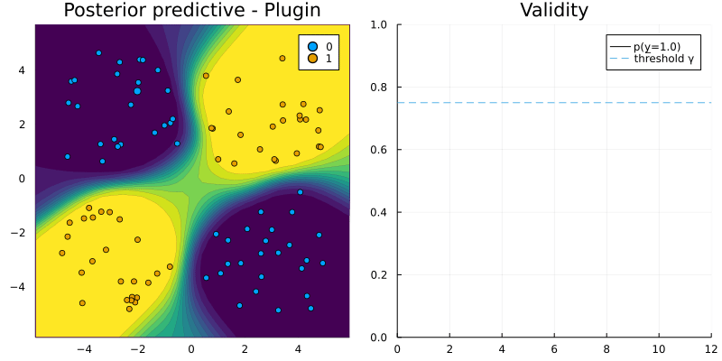

``` @meta
CurrentModule = CounterfactualExplanations 
```

# Interoperability

The Julia language offers unique support for programming language interoperability. For example, calling Python and R is made remarkably easy through `PyCall.jl` and `RCall.jl`. In this tutorial we will see how `CounterfactualExplanations.jl` leverages this functionality. In particular, we will see that through minimal extra effort the package can be used to explain models that were developed in train in Python or R.

    !!! warning "Experimental feature"
        Our work on language interoperability is still in its early stages. What follows is a proof-of-concept.

To get started we will first load some two-dimensional toy data:

``` julia
using Random
# Some random data:
Random.seed!(1234);
N = 100
using CounterfactualExplanations
using CounterfactualExplanations.Data
xs, ys = Data.toy_data_non_linear(N)
X = hcat(xs...)
counterfactual_data = CounterfactualData(X,ys')
```

## `torch` model trained in R

The code below builds a simple MLP in R:

``` julia
using RCall
R"""
# Data
library(torch)
X <- torch_tensor(t($X))
ys <- torch_tensor($ys)

# Model:
mlp <- nn_module(
  initialize = function() {
    self$layer1 <- nn_linear(2, 32)
    self$layer2 <- nn_linear(32, 1)
  },
  forward = function(input) {
    input <- self$layer1(input)
    input <- nnf_sigmoid(input)
    input <- self$layer2(input)
    input
  }
)
model <- mlp()
optimizer <- optim_adam(model$parameters, lr = 0.1)
loss_fun <- nnf_binary_cross_entropy_with_logits
"""
```

The following code trains the MLP for the binary prediction task at hand:

``` julia
R"""
for (epoch in 1:100) {

  model$train()  

  # Compute prediction and loss:
  output <- model(X)[,1]
  loss <- loss_fun(output, ys)

  # Backpropagation:
  optimizer$zero_grad()
  loss$backward()
  optimizer$step()
  
  cat(sprintf("Loss at epoch %d: %7f\n", epoch, loss$item()))
}
"""
```

### Making the model compatible

As always we need to extend the `logits` and `probs` functions to make the model compatible with `CounterfactualExplanations.jl`. As evident from the code below, this is actually quite straight-forward: the logits are returned by the `torch` model and copied form R into the Julia environment. Probabilities are then computed in Julia, by passing the logits through the sigmoid function.

``` julia
using Flux
using CounterfactualExplanations, CounterfactualExplanations.Models
import CounterfactualExplanations.Models: logits, probs # import functions in order to extend

# Step 1)
struct TorchNetwork <: Models.AbstractFittedModel
    nn::Any
end

# Step 2)
function logits(M::TorchNetwork, X::AbstractArray)
  nn = M.nn
  ŷ = rcopy(R"as_array($nn(torch_tensor(t($X))))")
  ŷ = isa(ŷ, AbstractArray) ? ŷ : [ŷ]
  return ŷ'
end
probs(M::TorchNetwork, X::AbstractArray)= σ.(logits(M, X))
M = TorchNetwork(R"model")
```

### Adapting the generator

Next we need to do a tiny bit of work on the `AbstractGenerator` side. By default methods underlying the `GenericGenerator` are desiged to work with models that have gradient access through `Zygote.jl`, one of Julia’s main autodifferentiation packages. Of course, `Zygote.jl` cannot access the gradients of our `torch` model, so we need to adapt the code slightly. Fortunately, it turns out that all we need to do is extend the function that computes the gradient with respect to the loss function for the generic counterfactual search: `∂ℓ(generator::GenericGenerator, x′, M, t)`. In particular, we will extend the function by a method that is specific to the `TorchNetwork` type we defined above. The code below implements this: our new method `∂ℓ` calls R in order to use `torch`’s autodifferentiation functionality for computing the gradient.

``` julia
import CounterfactualExplanations.Generators: ∂ℓ
using LinearAlgebra

# Countefactual loss:
function ∂ℓ(generator::AbstractGradientBasedGenerator, counterfactual_state::CounterfactualState) 
  M = counterfactual_state.M
  nn = M.nn
  x′ = counterfactual_state.x′
  t = counterfactual_state.target_encoded
  R"""
  x <- torch_tensor($x′, requires_grad=TRUE)
  output <- $nn(x)
  obj_loss <- nnf_binary_cross_entropy_with_logits(output,$t)
  obj_loss$backward()
  """
  grad = rcopy(R"as_array(x$grad)")
  return grad
end
```

### Generating counterfactuals

From here on onwards we use the `CounterfactualExplanations.jl` functionality as always. Below we choose a random sample, define our generic generator and finally run the search:

``` julia
# Randomly selected factual:
Random.seed!(123)
x = select_factual(counterfactual_data, rand(1:length(xs))) 
y = round(probs(M, x)[1])
target = ifelse(y==1.0,0.0,1.0) # opposite label as target
```

``` julia
# Define generator:
generator = GenericGenerator()
# Generate recourse:
counterfactual = generate_counterfactual(x, target, counterfactual_data, M, generator)
```



## Training a `torch` model in Python

``` julia
using PyCall
py"""
# Data
import torch
from torch import nn
X = torch.Tensor($X).T
ys = torch.Tensor($ys)

class MLP(nn.Module):
  def __init__(self):
    super(MLP, self).__init__()
    self.model = nn.Sequential(
      nn.Flatten(),
      nn.Linear(2, 32),
      nn.Sigmoid(),
      nn.Linear(32, 1)
    )

  def forward(self, x):
    logits = self.model(x)
    return logits

model = MLP()
optimizer = torch.optim.Adam(model.parameters(), lr=0.1)
loss_fun = nn.BCEWithLogitsLoss()
"""
```

``` julia
py"""
for epoch in range(100):
  # Compute prediction and loss:
  output = model(X).squeeze()
  loss = loss_fun(output, ys)
  
  # Backpropagation:
  optimizer.zero_grad()
  loss.backward()
  optimizer.step()
  print(f"Loss at epoch {epoch+1}: {loss.item():>7f}")
"""
```

``` julia
using Flux
using CounterfactualExplanations, CounterfactualExplanations.Models
import CounterfactualExplanations.Models: logits, probs # import functions in order to extend

# Step 1)
struct PyTorchNetwork <: Models.AbstractFittedModel
    nn::Any
end

# Step 2)
function logits(M::PyTorchNetwork, X::AbstractArray)
  nn = M.nn
  if !isa(X, Matrix)
    X = reshape(X, length(X), 1)
  end
  ŷ = py"$nn(torch.Tensor($X).T).detach().numpy()"
  ŷ = isa(ŷ, AbstractArray) ? ŷ : [ŷ]
  return ŷ
end
probs(M::PyTorchNetwork, X::AbstractArray)= σ.(logits(M, X))
M = PyTorchNetwork(py"model")
```

``` julia
import CounterfactualExplanations.Generators: ∂ℓ
using LinearAlgebra

# Countefactual loss:
function ∂ℓ(generator::AbstractGradientBasedGenerator, counterfactual_state::CounterfactualState) 
  M = counterfactual_state.M
  nn = M.nn
  x′ = counterfactual_state.x′
  t = counterfactual_state.target_encoded
  x = reshape(x′, 1, length(x′))
  py"""
  x = torch.Tensor($x)
  x.requires_grad = True
  t = torch.Tensor($[t]).squeeze()
  output = $nn(x).squeeze()
  obj_loss = nn.BCEWithLogitsLoss()(output,t)
  obj_loss.backward()
  """
  grad = vec(py"x.grad.detach().numpy()")
  return grad
end
```

``` julia
# Define generator:
generator = GenericGenerator()
# Generate recourse:
counterfactual = generate_counterfactual(x, target, counterfactual_data, M, generator)
```


