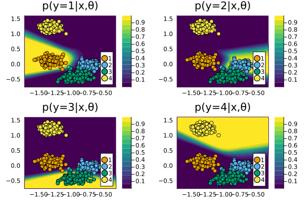

``` @meta
CurrentModule = CounterfactualExplanations 
```

# Model Catalogue

While in general it is assumed that users will use this package to explain their pre-trained models, we provide out-of-the-box functionality to train various simple default models. In this tutorial, we will see how these models can be fitted to `CounterfactualData`.

## Available Models

The `model_catalogue` can be used to inspect the available default models:

``` julia
model_catalogue
```

    Dict{Symbol, Any} with 3 entries:
      :Linear       => Linear
      :DeepEnsemble => FluxEnsemble
      :MLP          => FluxModel

As with the [`data_catalogue`](@ref), the dictionary keys correspond to the model names. In this case, the dictionary values are constructors that can be used called on instances of type `CounterfactualData` to fit the corresponding model. In most cases, users will find it most convenient to use the [`fit_model`](@ref) API call instead.

## Fitting Models

First, let’s load one of the synthetic datasets:

``` julia
n = 500
counterfactual_data = load_multi_class(n)
```

We could use a Deep Ensemble (Lakshminarayanan, Pritzel, and Blundell 2016) as follows:

``` julia
M = fit_model(counterfactual_data, :DeepEnsemble)
```

The returned object is an instance of type `FluxEnsemble <: AbstractFittedModel` and can be used in downstream tasks without further ado. For example, the resulting fit can be visualised using the generic `plot()` method as:

``` julia
plts = []
for target in counterfactual_data.y_levels
    plt = plot(M, counterfactual_data; target=target, title="p(y=$(target)|x,θ)")
    plts = [plts..., plt]
end
plot(plts...)
```



## Tuning Models

By default, model architectures are very simple. Through optional arguments, users have some control over the neural network architecture and can choose to impose regularization through dropout. Let’s tackle a more challenging dataset: MNIST (LeCun 1998).

``` julia
counterfactual_data = load_mnist(10000)
train_data, test_data = 
    CounterfactualExplanations.DataPreprocessing.train_test_split(counterfactual_data)
```


In this case, we will use a Multi-Layer Perceptron (MLP) but we will adjust the model and training hyperparameters. Parameters related to training of `Flux.jl` models are currently stored in a mutable container:

``` julia
flux_training_params
```

    CounterfactualExplanations.FluxModelParams
      loss: Symbol logitbinarycrossentropy
      opt: Symbol Adam
      n_epochs: Int64 100
      batchsize: Int64 1
      verbose: Bool false

In cases like this one, where model training can be expected to take a few moments, it can be useful to activate verbosity, so let’s set the corresponding field value to `true`. We’ll also impose mini-batch training:

``` julia
flux_training_params.verbose = true
flux_training_params.batchsize = round(size(train_data.X,2)/10)
```

To account for the fact that this is a slightly more challenging task, we will use an appropriate number of hidden neurons per layer. We will also activate dropout regularization. To scale networks up further, it is also possible to adjust the number of hidden layers, which we will not do here.

``` julia
model_params = (
    n_hidden = 32,
    dropout = true
)
```

The `model_params` can be supplied to the familiar API call:

``` julia
M = fit_model(train_data, :MLP; model_params...)
```

    FluxModel(Chain(Dense(784 => 32, relu), Dropout(0.25), Dense(32 => 10)), :classification_multi)

The model performance on our test set can be evaluated as follows:

``` julia
model_evaluation(M, test_data)
```

    0.9269093812317137

Finally, let’s restore the default training parameters:

``` julia
CounterfactualExplanations.reset!(flux_training_params)
```

## References

Lakshminarayanan, Balaji, Alexander Pritzel, and Charles Blundell. 2016. “Simple and Scalable Predictive Uncertainty Estimation Using Deep Ensembles.” <https://arxiv.org/abs/1612.01474>.

LeCun, Yann. 1998. “The MNIST Database of Handwritten Digits.”
