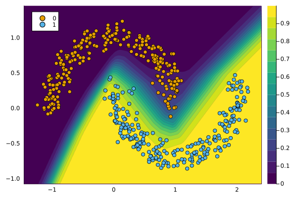

``` @meta
CurrentModule = CounterfactualExplanations 
```

# Handling Models

The typical use-case for Counterfactual Explanations and Algorithmic Recourse is as follows: users have trained some supervised model that is not inherently interpretable and are looking for a way to explain it. In this tutorial, we will see how pre-trained models can be used with this package.

## Models trained in `Flux.jl`

We will train a simple binary classifier in `Flux.jl` on the popular Moons dataset:

``` julia
n = 500
data = TaijaData.load_moons(n)
counterfactual_data = DataPreprocessing.CounterfactualData(data...)
X = counterfactual_data.X
y = counterfactual_data.y
plt = plot()
scatter!(counterfactual_data)
```


The following code chunk sets up a Deep Neural Network for the task at hand:

``` julia
data = Flux.DataLoader((X,y),batchsize=1)
input_dim = size(X,1)
n_hidden = 32
activation = relu
output_dim = 2
nn = Chain(
    Dense(input_dim, n_hidden, activation),
    Dropout(0.1),
    Dense(n_hidden, output_dim)
)
loss(yhat, y) = Flux.Losses.logitcrossentropy(nn(yhat), y)
```

Next, we fit the network to the data:

``` julia
using Flux.Optimise: update!, Adam
opt = Adam()
epochs = 100
avg_loss(data) = mean(map(d -> loss(d[1],d[2]), data))
show_every = epochs/5
# Training:
for epoch = 1:epochs
  for d in data
    gs = gradient(Flux.params(nn)) do
      l = loss(d...)
    end
    update!(opt, Flux.params(nn), gs)
  end
  if epoch % show_every == 0
    println("Epoch " * string(epoch))
    @show avg_loss(data)
  end
end
```

    Epoch 20
    avg_loss(data) = 0.1407434f0
    Epoch 40
    avg_loss(data) = 0.11345118f0
    Epoch 60
    avg_loss(data) = 0.046319224f0
    Epoch 80
    avg_loss(data) = 0.011847609f0
    Epoch 100
    avg_loss(data) = 0.007242911f0

To prepare the fitted model for use with our package, we need to wrap it inside a container. For plain-vanilla models trained in `Flux.jl`, the corresponding constructor is called [`FluxModel`](@ref). There is also a separate constructor called [`FluxEnsemble`](@ref), which applies to Deep Ensembles. Deep Ensembles are a popular approach to approximate Bayesian Deep Learning and have been shown to generate good predictive uncertainty estimates (Lakshminarayanan, Pritzel, and Blundell 2016).

The appropriate API call to wrap our simple network in a container follows below:

``` julia
M = FluxModel(nn)
```

    FluxModel(Chain(Dense(2 => 32, relu), Dropout(0.1, active=false), Dense(32 => 2)), :classification_binary)

The likelihood function of the output variable is automatically inferred from the data. The generic `plot()` method can be called on the model and data to visualise the results:

``` julia
plot(M, counterfactual_data)
```



Our model `M` is now ready for use with the package.

## References

Lakshminarayanan, Balaji, Alexander Pritzel, and Charles Blundell. 2016. “Simple and Scalable Predictive Uncertainty Estimation Using Deep Ensembles.” <https://arxiv.org/abs/1612.01474>.
