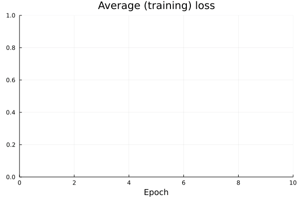

```@meta
CurrentModule = AlgorithmicRecourse 
```

# Recourse for multi-class targets


```julia
using Flux, Random, Plots, PlotThemes, AlgorithmicRecourse
theme(:wong)
using Logging
disable_logging(Logging.Info)
```


    LogLevel(1)


```julia
x, y = toy_data_multi()
X = hcat(x...)
y_train = Flux.onehotbatch(y, unique(y))
y_train = Flux.unstack(y_train',1)
plt = plot()
plt = plot_data!(plt,X',y);
savefig(plt, "www/multi_samples.png")
```


## Classifier


```julia
n_hidden = 32
out_dim = length(unique(y))
nn = build_model(output_dim=out_dim)
loss(x, y) = Flux.Losses.logitcrossentropy(nn(x), y)
ps = Flux.params(nn)
data = zip(x,y_train);
```


```julia
using Flux.Optimise: update!, ADAM
using Statistics
opt = ADAM()
epochs = 10
avg_loss(data) = mean(map(d -> loss(d[1],d[2]), data))

using Plots
anim = Animation()
plt = plot(ylim=(0,avg_loss(data)), xlim=(0,epochs), legend=false, xlab="Epoch")
avg_l = []

for epoch = 1:epochs
  for d in data
    gs = gradient(params(nn)) do
      l = loss(d...)
    end
    update!(opt, params(nn), gs)
  end
  avg_l = vcat(avg_l,avg_loss(data))
  plot!(plt, avg_l, color=1, title="Average (training) loss")
  frame(anim, plt)
end

gif(anim, "www/multi_loss.gif");
```


```julia
using AlgorithmicRecourse, AlgorithmicRecourse.Models
import AlgorithmicRecourse.Models: logits, probs # import functions in order to extend

# Step 1)
struct NeuralNetwork <: Models.FittedModel
    nn::Any
end

# Step 2)
logits(𝑴::NeuralNetwork, X::AbstractArray) = 𝑴.nn(X)
probs(𝑴::NeuralNetwork, X::AbstractArray)= softmax(logits(𝑴, X))
𝑴 = NeuralNetwork(nn)
```


    NeuralNetwork(Chain(Dense(2, 32, relu), Dense(32, 4)))


```julia
plt = plot_contour_multi(X',y,𝑴);
savefig(plt, "www/multi_contour.png")
```


```julia
# Randomly selected factual:
Random.seed!(42);
x̅ = X[:,rand(1:size(X)[2])]
y̅ = Flux.onecold(probs(𝑴, x̅),unique(y))
target = rand(unique(y)[1:end .!= y̅]) # opposite label as target
γ = 0.75
# Define Generator:
generator = GenericGenerator(0.1,0.1,1e-5,:logitcrossentropy,nothing)
# Generate recourse:
recourse = generate_recourse(generator, x̅, 𝑴, target, γ); # generate recourse
```


```julia
T = size(recourse.path)[1]
ŷ = AlgorithmicRecourse.target_probs(probs(recourse.𝑴, recourse.path'),target)
p1 = plot_contour_multi(X',y,𝑴;title="Neural network")
anim = @animate for t in 1:T
    scatter!(p1, [recourse.path[t,1]], [recourse.path[t,2]], ms=5, color=Int(y̅), label="")
    p2 = plot(1:t, ŷ[1:t], xlim=(0,T), ylim=(0, 1), label="p(y̲=" * string(target) * ")", title="Validity", lc=:black)
    Plots.abline!(p2,0,γ,label="threshold γ", ls=:dash) # decision boundary
    plot(p1,p2,size=(800,400))
end
gif(anim, "www/multi_generic_recourse.gif", fps=5);
```


## Deep ensemble


```julia
𝓜 = build_ensemble(5;kw=(output_dim=out_dim,));
```


```julia
𝓜, anim = forward(𝓜, data, opt, n_epochs=epochs, plot_every=1); # fit the ensemble
gif(anim, "www/multi_ensemble_loss.gif", fps=10);
```




```julia
# Step 1)
struct FittedEnsemble <: Models.FittedModel
    𝓜::AbstractArray
end

# Step 2)
using Statistics
logits(𝑴::FittedEnsemble, X::AbstractArray) = mean(Flux.stack([nn(X) for nn in 𝑴.𝓜],3), dims=3)
probs(𝑴::FittedEnsemble, X::AbstractArray) = mean(Flux.stack([softmax(nn(X)) for nn in 𝑴.𝓜],3),dims=3)

𝑴=FittedEnsemble(𝓜);
```


```julia
plt = plot_contour_multi(X',y,𝑴);
savefig(plt, "www/multi_ensemble_contour.png")
```


```julia
generator = GreedyGenerator(0.25,20,:logitcrossentropy,nothing)
recourse = generate_recourse(generator, x̅, 𝑴, target, γ); # generate recourse
```


```julia
T = size(recourse.path)[1]
ŷ = AlgorithmicRecourse.target_probs(probs(recourse.𝑴, recourse.path'),target)
p1 = plot_contour_multi(X',y,𝑴;title="Deep ensemble")
anim = @animate for t in 1:T
    scatter!(p1, [recourse.path[t,1]], [recourse.path[t,2]], ms=5, color=Int(y̅), label="")
    p2 = plot(1:t, ŷ[1:t], xlim=(0,T), ylim=(0, 1), label="p(y̲=" * string(target) * ")", title="Validity", lc=:black)
    Plots.abline!(p2,0,γ,label="threshold γ", ls=:dash) # decision boundary
    plot(p1,p2,size=(800,400))
end
gif(anim, "www/multi_greedy_recourse.gif", fps=5);
```


