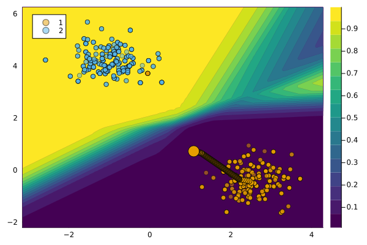

# Simple Example

``` @meta
CurrentModule = CounterfactualExplanations 
```

In this tutorial, we will go through a simple example involving synthetic data and a generic counterfactual generator.

## Data and Classifier

Below we generate some linearly separable data and fit a simple MLP classifier with batch normalization to it. For more information on generating data and models, refer to the `Handling Data` and `Handling Models` tutorials respectively.

``` julia
# Counteractual data and model:
flux_training_params.batchsize = 10
counterfactual_data = load_linearly_separable()
counterfactual_data.standardize = true
M = fit_model(counterfactual_data, :MLP, batch_norm=true)
```

## Counterfactual Search

Next, determine a target and factual class for our counterfactual search and select a random factual instance to explain.

``` julia
target = 2
factual = 1
chosen = rand(findall(predict_label(M, counterfactual_data) .== factual))
x = select_factual(counterfactual_data, chosen)
```

Finally, we generate and visualize the generated counterfactual:

``` julia
# Search:
generator = GenericGenerator()
ce = generate_counterfactual(x, target, counterfactual_data, M, generator)
plot(ce)
```


